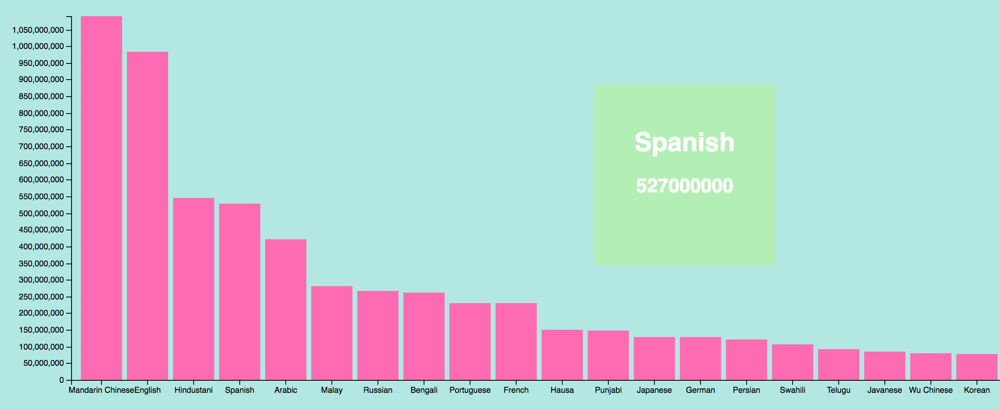

Graph by : [@MBostock](https://github.com/mbostock) 
Customisation by : [@muise001](https://github.com/muise001)

# Assesment 1

Bij deze opdracht konden we kiezen tussen een .json-, een .csv- en een .tsv-bestand. Deze moesten we doormiddel van een zelfgemaakte of een geleende d3 datavisualisatie tonen.

## super langdradige uitleg 

Als eerst koos ik een heel [lastige grafiek](https://bl.ocks.org/mbostock/3686329aa6e1f5938df8eef12ec353fe). Hij was niet alleen moeilijk door de gecompliceerde code, maar ook omdat de data die hij oorspronkelijk gebruikte in een .csv-bestand zat. Om het mezelf nog moeilijker te maken probeerde ik om hem ook nog eens om te schrijven naar .json. Dit leek een succes. Alle data werd zichtbaar in de console, maar er was geen grafiek te bekennen. Na uren gekloot gaf ik het op. Ik maakte een nieuw mapje aan "assesment 1 poging 2". Dit ging een stuk beter. Ik had een grafiek gekozen die werkte met een .tsv bestand en zorgde ervoor dat ik zelf ook een .tsv-bestand had. Ook hier moest ik eerst een hele tijd zoeken, maar ik kreeg hem aan de praat. Toen eenmaal al m'n data geuploaded was, wilde ik meer. De y-waarden van de balken waren namelijk moeilijk af te lezen. Ik besloot een nieuwe functie toe te voegen.

#### De nieuwe functie

Als extra functionaliteit heb ik toegevoegd dat als je op een balk klikt er rechts-boven in het scherm zowel de x- als y-waarde zichtbaar wordt in grote letters en getallen. Handig voor mensen met slechte ogen :wink:

#### veel te veel JavaScript

Nadat ik klaar was met het toevoegen van de "Data-Disclosure'er Ultimatum 300" a.k.a de extra functionaliteit, kwam ik erachter dat een hele hoop JavaScript code niks deed. Ik heb alle waardes geanalyseerd en verandert. Vaak was dan m'n hele grafiek weg (leermomentje), maar tot mijn verbazing gebeurde er soms helemaal niks. Ik heb geprobeerd al het overtollige JavaScript te verwijderen :angel:

## bronnen

* [__De Bar-Chart__](https://bl.ocks.org/mbostock/3885304)
* [__info over het lezen van data__](http://learnjsdata.com/read_data.html)
* [__info over het inladen van data__](http://www.knowstack.com/different-ways-of-loading-a-d3js-data/)
* [__info over json__](https://www.dashingd3js.com/using-json-to-simplify-code)
