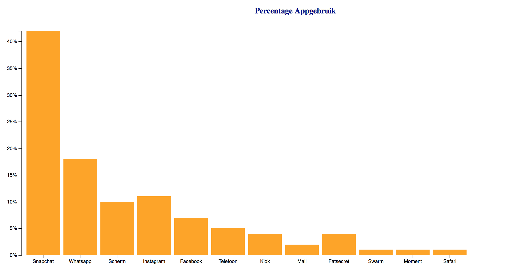

# Bar Chart Assignment
## Making a Bar Chart for the usage of my apps. 

For this assignment I made a Bar Chart including information of the usage of my Iphone apps. I used the codes for this assignment from the [Basis Bar Chart Section](https://bl.ocks.org/mbostock/3885304). 

First I copied the codes and paste it in my code editor. Step by step I adjusted the codes and put in my own measured information. After that I made a CSS file to style my Bar Chart. The data I used is listed below.

### The data I Used
1. letter	frequency
2. Snapchat	.4200
3. Whatsapp	.1800
4. Scherm	.1000
5. Instagram	.1100
6. Facebook	.0700
7. Telefoon	.0500
8. Klok	.0400
9. Mail	.0200
10. Fatsecret	.0400
11. Swarm	.0100
12. Moment	.0100
13. Safari	.0100

#### Link ot the handy d3 features 
[D3 API Link](https://github.com/d3/d3/blob/master/API.md)

MIT @ Björn Völkers

