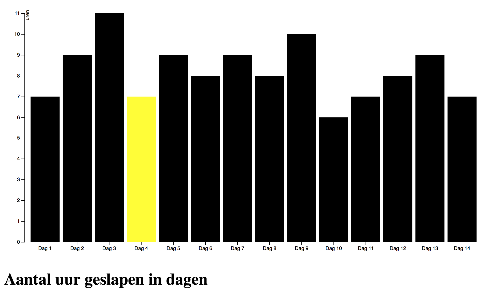

# Bar grafiek
Deze grafiek gaat over het aantal uur dat ik heb geslapen per dag.

[![][cover]][url]

## Achtergrond verhaal
Deze grafiek heb ik gemaakt met de data die ik de afgelopen 2 a 3 weken heb opgeslagen. Deze data heb ik gebruikt om de opdracht bar charts te maken voor het vak Front End 3.

## Data
Deze data heb ik handmatig bijgehouden per dag de data die je in de grafiek ziet is van de afgelopen 14 dagen en gemeten in uren.
De **Y-as** zijn het aantal uren
De **X-as** is welke dag

## Opties
- [`D3-DSV`](https://github.com/d3/d3-dsv)
- [`D3-format`](https://github.com/d3/d3-format)
- [`D3-scale`](https://github.com/d3/d3-scale)
- [`D3-array`](https://github.com/d3/d3-array)
- [`D3-axis`](https://github.com/d3/d3-axis)

## Licentie
GNU GPLv3 © Ryan Narain