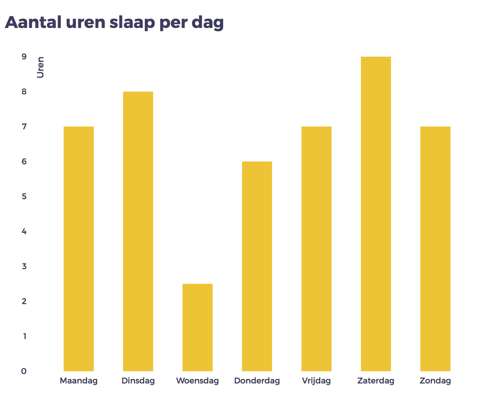

# Bar Chart - D3 library assignment

In this assignment regarding the [d3js](https://d3js.org/) library I'm researching what the possibilities are for data visualisation in bar charts, using an [example](https://bl.ocks.org/mbostock/3885304) from [Mike Bostock](https://bl.ocks.org/mbostock).

## Background

I'm a student at the University of Applied Sciences in Amsterdam. In the Frontend course I'm trying to get the hang of the D3 library. In this particular assignment I was asked to get into the code of D3 javascript and see what's going on.

This chart was created as a part of the course 'Front-end development 3', which is part of the study programme "Communication and Multimedia Design".

The data used was collected as part of another course ("Data Visualisation").

## Data

The used data is a representation of my sleeping pattern during week 38 of 2017.
On the y axis are the hours of sleep. The x axis fills up with the measured days. Nothing more to add really. It's a simple graph.

## Features

* [d3.csv](https://github.com/d3/d3-request#csv)
* [d3.select](https://github.com/d3/d3-selection#select)
* [d3.scaleBand()](https://github.com/d3/d3-scale#scaleBand)
* [d3.scaleLinear()](https://github.com/d3/d3-scale#scaleLinear)
* [d3.max](https://github.com/d3/d3-array#max)
* [d3.axisBottom()](https://github.com/d3/d3-axis#axisBottom)
* [d3.axisLeft()](https://github.com/d3/d3-axis#axisLeft)

## License

Released under the GNU General Public License, version 3. (from [original](https://bl.ocks.org/mbostock/3885304))
