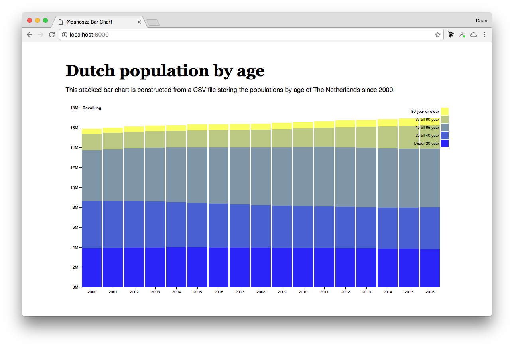
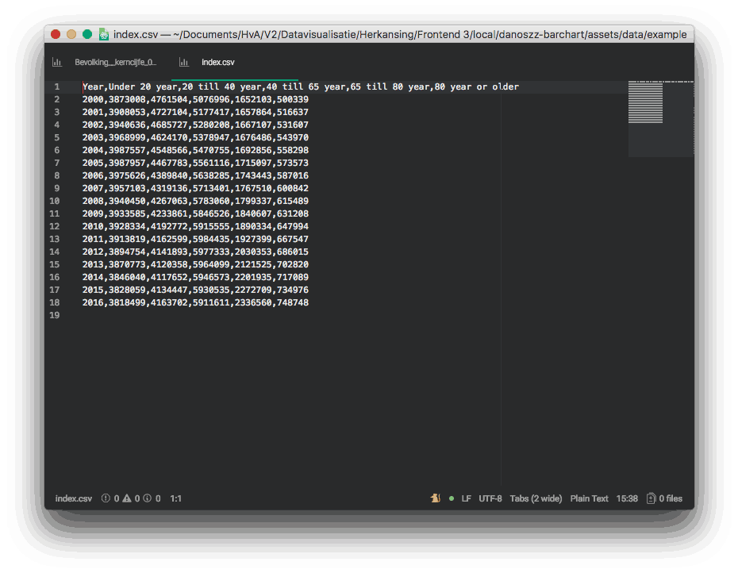

# Stacked Bar Chart

This stacked bar chart was created for [Class 1: Bar chart](https://github.com/cmda-fe3/course-17-18/blob/master/class-1.md#bar-chart) using [D3.js](https://d3js.org/)

.
> This is how the visualization should look like

## Background

Following steps have been taken in creating a bar chart with D3.js. These steps can be followed to recreate the result and can be seen as ***instructions***.

1. Browse and find a [example code](https://github.com/d3/d3/wiki/Gallery#basic-charts). This visual uses [the stacked bar chart](https://bl.ocks.org/mbostock/3886208)
2. Recreate files `index.html` and `data.csv` locally in a new directory.
3. Open your favorite terminal, type `cd`, drag and drop your directory (don't forget the extra space) and press `enter`.
4. Fired up a simple server with

```sh
python -m SimpleHTTPServer 8000
```

5. Test the bar chart and clean up files by separating HTML, CSS, CSV and JS into `index.html`, `index.css`, `index.js`, `index.csv`. Still got a working chart and no errors in your console? Nice you are good to go 🍾
6. Find external data source on example: the Dutch [CBS](http://statline.cbs.nl/Statweb/publication/?DM=SLNL&PA=37296ned&D1=8-13&D2=50-66&HDR=G1&STB=T&CHARTTYPE=2&VW=D) and download it.
7. Clean up CSV into a readable format for D3



> GIF explaining the CSV cleanup that had to be done 😟

8. Add some styling to the `index.css` and a small joke in `kek.js` (optional) the visualization is done! 🚀

## Data

The data is about population divided in age groups and can be read as following:

| Year | Under 20 year | 20 till 40 year | 40 till 65 year | 65 till 80 year | 80 year or older |
| ---- |:-------------:| ---------------:| ---------------:| ---------------:| ----------------:|
| 2000 | 3873008       | 4761504         | 5076996         | 1652103         | 500339           |
| 2001 | 3908053       | 4727104         | 5177417         | 1657864         | 516637           |
| 2002 | 3940636       | 4685727         | 5280208         | 1667107         | 531607           |
| 2003 | 3968999       | 4624170         | 5378947         | 1676486         | 543970           |
| 2004 | 3987557       | 4548566         | 5470755         | 1692856         | 558298           |
| 2005 | 3987957       | 4467783         | 5561116         | 1715097         | 573573           |
| 2006 | 3975626       | 4389840         | 5638285         | 1743443         | 587016           |
| 2007 | 3957103       | 4319136         | 5713401         | 1767510         | 600842           |
| 2008 | 3940450       | 4267063         | 5783060         | 1799337         | 615489           |
| 2009 | 3933585       | 4233861         | 5846526         | 1840607         | 631208           |
| 2010 | 3928334       | 4192772         | 5915555         | 1890334         | 647994           |
| 2011 | 3913819       | 4162599         | 5984435         | 1927399         | 667547           |
| 2012 | 3894754       | 4141893         | 5977333         | 2030353         | 686015           |
| 2013 | 3870773       | 4120358         | 5964099         | 2121525         | 702820           |
| 2014 | 3846040       | 4117652         | 5946573         | 2201935         | 717089           |
| 2015 | 3828059       | 4134447         | 5930535         | 2272709         | 734976           |
| 2016 | 3818499       | 4163702         | 5911611         | 2336560         | 748748           |

## Features

The used JS code contains the following D3 Features:

- [d3-dsv](https://github.com/d3/d3-dsv) - load and parse data
- [d3-scale](https://github.com/d3/d3-scale) - x- and y-position, and color encoding
- [d3-format](https://github.com/d3/d3-format) - SI prefix formatting (e.g., “10M” for 10,000,000)
- [d3-array](https://github.com/d3/d3-array) - compute simple statistics (e.g., max)
- [d3-axis](https://github.com/d3/d3-axis) - display axes
- [d3-shape](https://github.com/d3/d3-shape) - computed stacked positions

## License

MIT License

Copyright (c) 2017 Daan van der Zwaag

Permission is hereby granted, free of charge, to any person obtaining a copy
of this software and associated documentation files (the "Software"), to deal
in the Software without restriction, including without limitation the rights
to use, copy, modify, merge, publish, distribute, sublicense, and/or sell
copies of the Software, and to permit persons to whom the Software is
furnished to do so, subject to the following conditions:

The above copyright notice and this permission notice shall be included in all
copies or substantial portions of the Software.

THE SOFTWARE IS PROVIDED "AS IS", WITHOUT WARRANTY OF ANY KIND, EXPRESS OR
IMPLIED, INCLUDING BUT NOT LIMITED TO THE WARRANTIES OF MERCHANTABILITY,
FITNESS FOR A PARTICULAR PURPOSE AND NONINFRINGEMENT. IN NO EVENT SHALL THE
AUTHORS OR COPYRIGHT HOLDERS BE LIABLE FOR ANY CLAIM, DAMAGES OR OTHER
LIABILITY, WHETHER IN AN ACTION OF CONTRACT, TORT OR OTHERWISE, ARISING FROM,
OUT OF OR IN CONNECTION WITH THE SOFTWARE OR THE USE OR OTHER DEALINGS IN THE
SOFTWARE.
