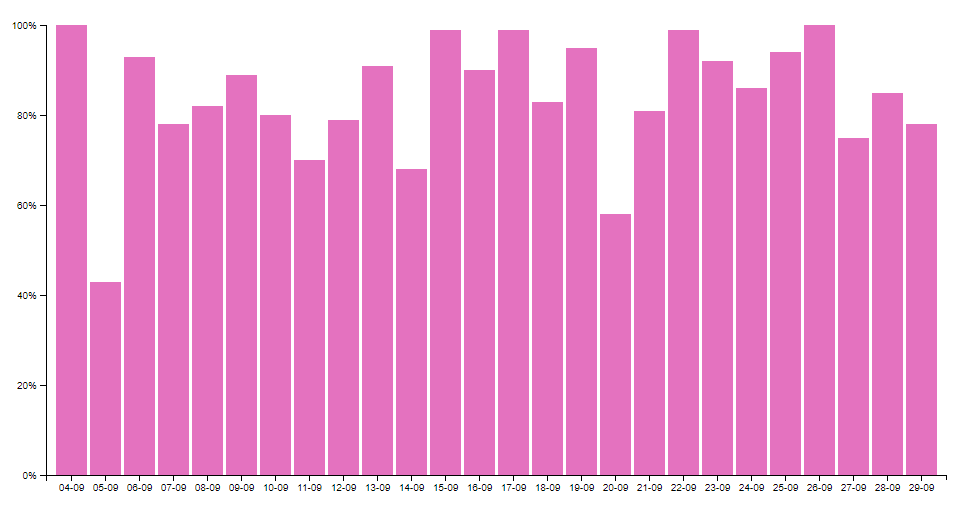

# Bar Chart 
__Sleep Quality Chart__

## Description
This is a D3 bar chart which contains personal sleep data information.  

## Background
This bar chart is based on an existing D3 example, Mike Bostock's [Simple Bar Chart](https://bl.ocks.org/mbostock/3885304 "Bl.ocks.org"). As such, it employs many similar D3 features. 

## Data
Listed is __sleep quality__ information, as collected by the [Sleep Cycle Alarm Clock app](https://itunes.apple.com/us/app/sleep-cycle-alarm-clock/id320606217?mt=8 "Sleep Cycle on App Store") over the course of 27 days. All data are input as percentage values (0-100) and are logged in an external .TSV file of 27 rows. 

## Features 
List of used D3 features in this chart: 

* [d3-dsv](https://github.com/d3/d3-dsv)

* [d3-format](https://github.com/d3/d3-format)

* [d3-scale](https://github.com/d3/d3-scale) 

* [d3-array](https://github.com/d3/d3-array)

* [d3-axis](https://github.com/d3/d3-axis)

## License
[GPL](https://opensource.org/licenses/GPL-3.0) © Faéna de Vries
