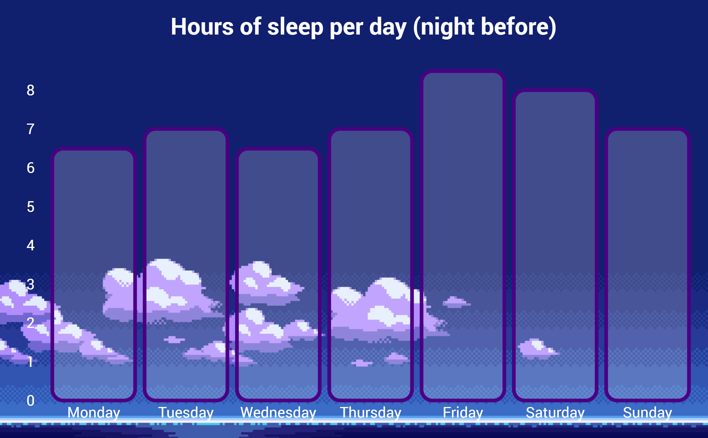

# Bar chart - Hours of sleep

A bar chart displaying the hours of sleep over week 39.

## Background

This chart was created as a part of the course 'Front-end development 3', which is part of the study programme "Communication and Multimedia Design".

The data used was collected as part of another course ("Data Visualisation"). 

## Data

The visualised data are the hours that I've slept in week 39 (25 Sep - 1 Oct). Every day lists the amount of hours that I've slept during the night *before that day*. For example, if Monday reads 8 hours, that means on the night of Sunday to Monday I slept 8 hours.

Each column (x-axis) represents a day, the columns' height represents the amount of hours (y-axis).

## Features

* [d3.csv](https://github.com/d3/d3-request#csv)
* [d3.select](https://github.com/d3/d3-selection#select)
* [d3.scaleBand()](https://github.com/d3/d3-scale#scaleBand)
* [d3.scaleLinear()](https://github.com/d3/d3-scale#scaleLinear)
* [d3.max](https://github.com/d3/d3-array#max)
* [d3.axisBottom()](https://github.com/d3/d3-axis#axisBottom)
* [d3.axisLeft()](https://github.com/d3/d3-axis#axisLeft)

## License

Released under the GNU General Public License, version 3. (from [original](https://bl.ocks.org/mbostock/3885304))
