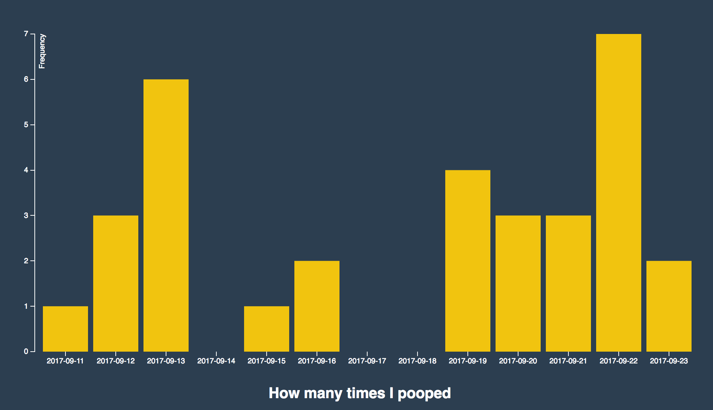

# Poop Chart

In this repository you can see when I **pooped** and how much I **pooped**.
Interesting! Sortof.

## Background
I made this bar chart for the subject front-end 3, I collected the data
for the class Data visualisation. I have been tracking how much I **pooped**
each day from 11th of september till now.

## Feautures
* [d3-array](https://github.com/d3/d3-array#api-reference) — d3.max — Array statistics
* [d3-axis](https://github.com/d3/d3-axis#api-reference )— d3.axisBottom and d3.axisLeft — Reference marks for scales
* [d3-request](https://github.com/d3/d3-request#api-reference) — d3.csv — Loading files
* [d3-scale](https://github.com/d3/d3-scale#api-reference) — d3.scaleBand and d3.scaleLinear — Position encodings
* [d3-selection](https://github.com/d3/d3-selection#api-reference) — d3.select — Select elements

## License
This block appears to have no license. Please contact the author to request a license.
>Source: https://bl.ocks.org/Caged/6476579
