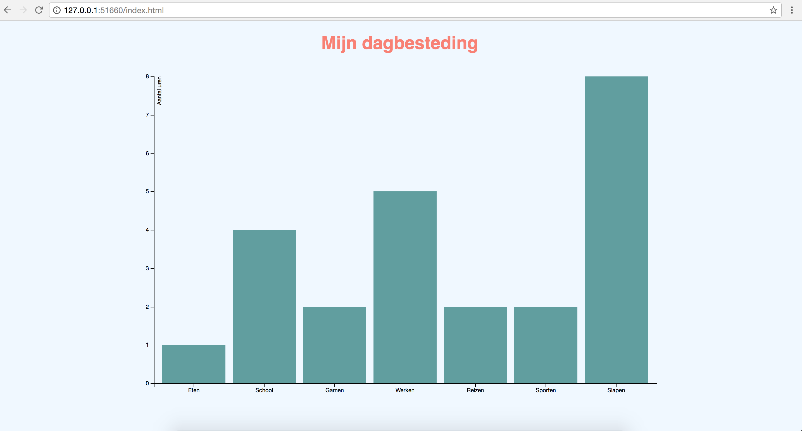

# My Daily Activities

_This Chart shows how many Hours I spend on my daily Activities._

##  Background
I made the Chart with csv database, d3.js framework, HTML and CSS.
The first step was choosing a default Chart. I made my own csv database, and changed 
some lines in the .js. I put in some comments to make it easier to understand the lines. 

Next thing was the Styling. I gave it some colours of which I think go nice together. 
I put in a hover styling for the bars to give it a nice feeling and I lined out everything in the middle.

## Data
The data I used in my csv document is:

<table>
  <tr>
    <th>gedaan</th>
    <th>hoelang</th>
  </tr>
  <tr>
    <td>Eten</td>
    <td>1</td>
  </tr>
  <tr>
    <td>School</td>
    <td>4</td>
  </tr>
  <tr>
    <td>Gamen</td>
    <td>2</td>
  </tr>
  <tr>
    <td>Werken</td>
    <td>5</td>
  </tr>
  <tr>
    <td>Reizen</td>
    <td>2</td>
  </tr>
  <tr>
    <td>Sporten</td>
    <td>2</td>
  </tr>
  <tr>
    <td>School</td>
    <td>8</td>
  </tr>
</table>

## Features
I featured the d3 scaling and select to generate a SVG. 
To get the data out my csv I used the d3.csv.

## License

MIT License

Based on https://bl.ocks.org/mbostock/3885304 by Mike Bostock

