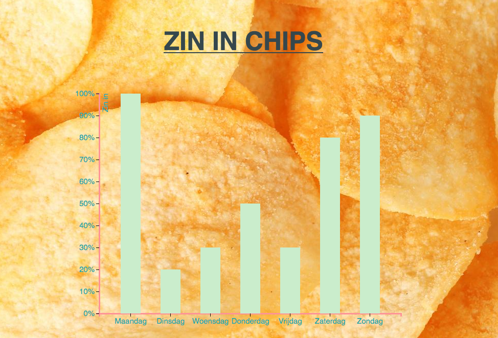

# Zin in chips
Op deze grafiek is te zien hoe veel zin ik had in chips vorige week.

## Background
Met gebruik van d3 heb ik een simpele barchart aangepast naar een persoonlijke barchart. Met gebruik van javascript, CSS en HTML

## Data
Op de y as is het procent zin te zien, 100% betekend heel erg zin in, en 0% betekend geen zin. 
Op de x as staan de dagen van de week, maandag tot en met zondag. Er is dus te zien hoe veel zin ik had in chips in een week tijd.

## Features
**Original work:** [link](https://bl.ocks.org/mbostock/3885304)
Voor de rest heb ik kleine dingen aangepast in de data, en vormgeving. Ook heb ik een achtergrond toegevoegd en de grafiek kleiner gemaakt en gecentreerd. De data komt van een TSV file. 

    * d3-dsv - parse tab-separated values
    * d3-format - number formatting
    * d3-scale - position encodings
    * d3-array - data processing
    * d3-axis - axes

## License
Released under the GNU General Public License, version 3. 

.
