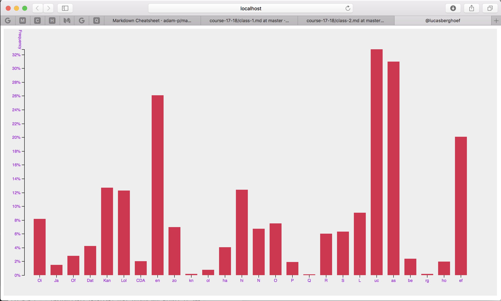

# Simple Bar Chart

This is a homework assignment that required me to install, inspect and deconstruct one of D3's standard bar charts.

## Background
In this assignment we had to split the original code up into an index.js file, an index.css file and the html file. This way we learned how to link from the html file to the javascript file. 

We also had to change values in the javascript code so we were able to see what happened when changing those values. This way we learned the basics of the used code.

## Data
The data in this file is completely made up. We have a "letter"  value and a "frequency" value which are distributed to the x- and y axis respectively.

## Features
### D3
* [select](https://github.com/d3/d3-selection/blob/master/README.md#selection_select) - select a descendant element for each selected element.
* [scaleBand](https://github.com/d3/d3-scale#scaleBand) - Constructs a new band scale with the empty domain, the unit range [0, 1], no padding, no rounding and center alignment.
* [scaleLinear](https://github.com/d3/d3-scale#scaleLinear) - Constructs a new continuous scale with the unit domain [0, 1], the unit range [0, 1], the default interpolator and clamping disabled.
* [tsv](https://github.com/d3/d3-request/blob/master/README.md#tsv) - get a tab-separated values (TSV) file.
* [max](https://github.com/d3/d3-array/blob/master/README.md#max) - compute the maximum value in an array.
* [axisBottom](https://github.com/d3/d3-axis#axisBottom) - Constructs a new bottom-oriented axis generator for the given scale, with empty tick arguments, a tick size of 6 and padding of 3. In this orientation, ticks are drawn below the horizontal domain path.
* [axisLeft](https://github.com/d3/d3-axis#axisLeft) - Constructs a new left-oriented axis generator for the given scale, with empty tick arguments, a tick size of 6 and padding of 3. In this orientation, ticks are drawn to the left of the vertical domain path.

## License

Released under the [GNU General Public License, version 3](https://opensource.org/licenses/GPL-3.0). © Lucas Berghoef
