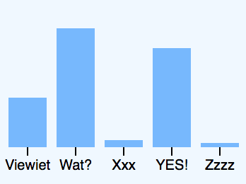

# extra info 
## Description
*'Meest voorkomende uitroepen en kreten in Het Nederlands volgens drs. M van Cruchten'* is written in Dutch. English translation of the title is: *'Most frequent Exclamations and Remarks in Dutch according to drs. M van Cruchten'.*
## Background
I made the chart as an exercise in an attempt to learn d3. The data are fake. Drs. is a Dutch title which means 'master', as I got my master (in the Arts) at the University of Amsterdam. In daily life I never use my masters titel but now I thought it would be funny to use it and add a little credebility to the fake data.
## Data
The data are fake. The data are based on [Mike Bostocks basic bar chart](https://bl.ocks.org/mbostock/3885304) that describe the most frequnetly used letters in English.
## Features
* [d3-dsv](https://github.com/d3/d3-dsv) - parse tab-separated values
* [d3-format](https://github.com/d3/d3-format) - number formatting
* [d3-scale](https://github.com/d3/d3-scale) - position encodings
* [d3-array](https://github.com/d3/d3-array) - data processing
* [d3-axis](https://github.com/d3/d3-axis) - axes
## License
MIT © Maaike van Cruchten
