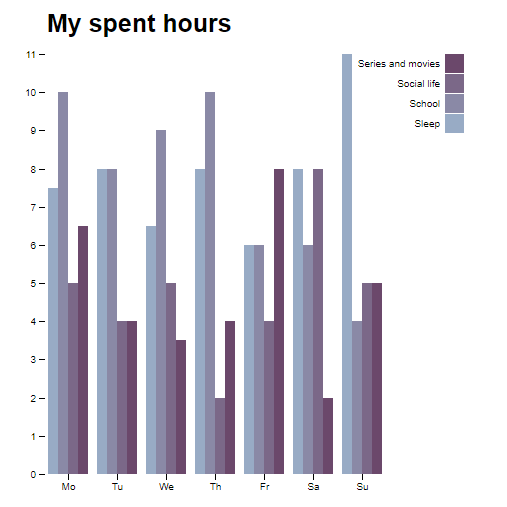

# My spent hours
This is a simple bar chart visualizing my spent hours in a week time. This chart was based on [**Grouped Bar Chart**](https://bl.ocks.org/mbostock/3887051) by Mike Bostock.

## Background 
At my study, Communication and Multimedia Design I have a subject about data visualization. We had to collect data from our daily life. In this graph you can see how I spent my week. My spent hours were divided in the following categories:
* Sleep
* School
* Social life
* Series and movies

## Data 
Comma-separated values (CSV) with eight rows and five columns:
* `letters` — The letters stand for an abbreviation  for a day of a week. 
* `frequency` — Number describing how many hours I spent on a subject.

## Features 
The chart employs conventional margins and a number of D3 features:

* [`d3.csv`](https://github.com/d3/d3-request/blob/master/README.md#csv)- load and parse data
* [`d3.scale.ordinal`](https://github.com/d3/d3-scale/blob/master/README.md#scaleOrdinal) - x-position encoding and color encoding
* [`d3.scale.linear`](https://github.com/d3/d3-scale/blob/master/README.md#scaleLinear) - y-position encoding
* [`d3.max`](https://github.com/d3/d3-array/blob/master/README.md#max) - compute domains
* [`d3.keys`](https://github.com/d3/d3-collection/blob/master/README.md#keys) - compute column names
* [`d3.svg.axis`](https://github.com/d3/d3-axis/blob/master/README.md#_axis) - display axes

## License 
[GNU General Public License](https://opensource.org/licenses/GPL-3.0), version 3 © Luisa Braga dos Santos
