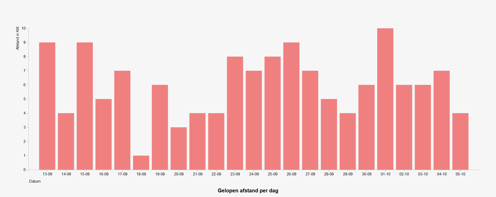

# Bar Chart

A barchar which indicated the distanced that has been walked per day.
  based on a example from [bl.ocks.org](https://bl.ocks.org).

Source code: [Bar chart source](https://bl.ocks.org/mbostock/3885304) by [@mbostock](https://github.com/mbostock) (GPL-3.0).

## Features
The following D3 API's were used:
- [`d3-request`](https://github.com/d3/d3-request)
	- d3.json - get a JavaScript Objext Notation (JSON) file
- [`d3-scale`](https://github.com/d3/d3-scale)
	- d3.scaleBand --  create an ordinal band scale
	- d3.scaleLinear -- create an linear scale
	- d3.domain -- set the input domain
	- d3.range -- set the output range
	- d3.paddingInner -- set padding between bands
- [`d3.selection`](https://github.com/d3/d3-selection)
	- d3.select -- select an element from the document
	- d3.selectAll -- select multiple elements from the document
	- d3.append -- create, append and select new elements
	- d3.attr -- get or set an attribute.
	- d3.enter -- get the enter selection (data missing elements)
	- d3.data -- join element to data
	- d3.text -- get or set the text content
- [`d3.axis`](https://github.com/d3/d3-axis)
	- d3.axisBottom -- create a new bottom-oriented axis generator
	- d3.axisLeft -- create a new left-oriented axis generator

## Added Features
These are the features added:
- Replaced the original data with my own data
- Added some style

## License
© Jun Spaarwater
