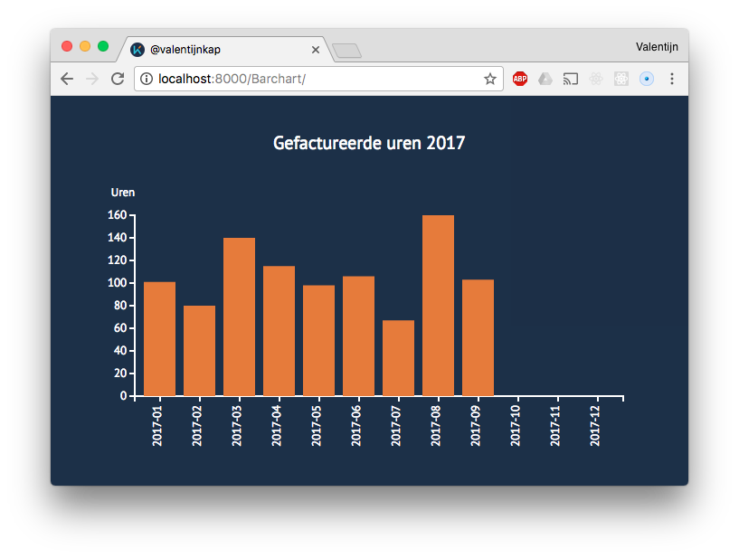

Based on the example from [D3Noob](http://bl.ocks.org/d3noob/8952219)

# Barchart

I made a barchart with (fictional) data about my company in the year 2017. The barchart shows how many hours I invoiced each month.

## Background
I follow the course Frontend 3 and my first assignment was: making a simple barchart based on a example from the d3 library. So I found d3noob his barchart and used it for my own data. I changed the colors, labels an tweaked the code a little bit.

## Data
To visualize my data I used two variables. I took each month as a period and hours. I called it "Datum" and "uren". I stored the data in a .csv file.

## Features
* [.sellectAll()](https://github.com/d3/d3-selection)
* [.Axis()](https://github.com/d3/d3/blob/master/API.md#axes-d3-axis)

## License
Software: [MIT](license.md) © [Valentijn Kap](https://www.valentijnkap.nl)
