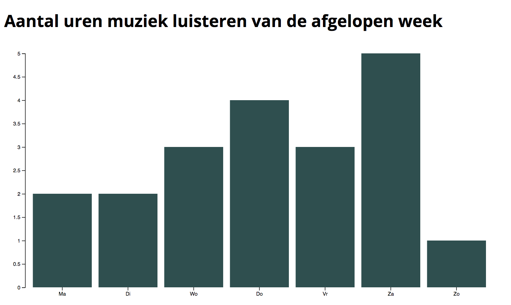

# Bar Chart
A graph about listening music per week

## Background
This is my graph describing how much music i listened last week. From monday to sunday.

## Data
The visualised data describes how much music i listened to music last week. The data inside the graph is a .TSV format with 2 columns. Inside the 2 columns there are 16 fields.

## Features
- [`D3-DSV`](https://github.com/d3/d3-dsv)
- [`D3-format`](https://github.com/d3/d3-format)
- [`D3-scale`](https://github.com/d3/d3-scale)
- [`D3-array`](https://github.com/d3/d3-array)
- [`D3-axis`](https://github.com/d3/d3-axis)

## License
GNU GPLv3 © Wesley Cheng

