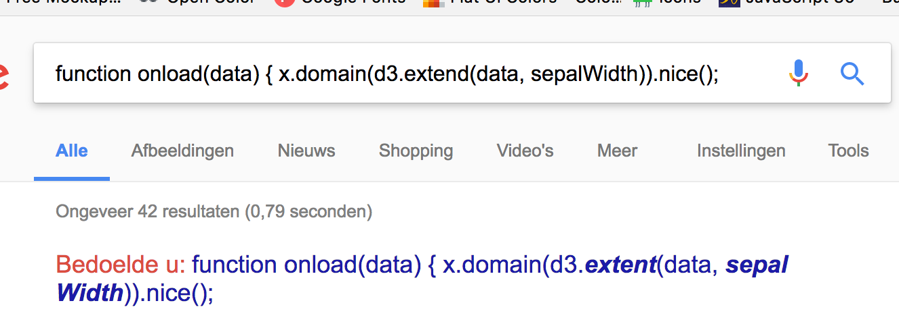

# Scatter plot

A simple responsive scatter plot visualising the dimensions of sepals and petals
of various iris flowers based on a [`bl.ock`][block] by
[**@mbostock**][block-author] (GPL-3.0).

[![][cover]][url]


## Background

In this assignment we had to find bugs in the files and debug them. We also had to refactor the files from d3.v3 to d3.v4.


### Debug & Refactor

Change the D3 from v3 to v4.

```
<script src="https://d3js.org/d3.v3.min.js"></script>

```
```
<script src="https://d3js.org/d3.v4.min.js"></script>

```

Refactor functions

```js
var x = d3.scale.linear().range([0, width]);
var y = d3.scale.linear().range([height, 0]);
var color = d3.scale.ordinal().range(['#fe2f2f', '#feca2f', '#96fe2f']);
var xAxis = d3.svg.axis().scale(x).orient('bottom');
var yAxis = d3.svg.axis().scale(y).orient('left');
```


```js
var x = d3.scaleLinear().range([0, width]);
var y = d3.scaleLinear().range([height, 0]);
var color = d3.scaleOrdinal()
.range(['#fe2f2f',
        '#feca2f',
        '#96fe2f']);

var xAxis = d3.axisBottom(x);
var yAxis = d3.axisLeft(y);;
```

### JS Bugs

#### Data

Changed tsv into csv as the data was formatted in a .csv file.

#### Margin

Changed the margin l,r,t,b

From this


```js

var width = 960 - margin.l - margin.r;
var height = 500 - margin.t - margin.b;

```

to this

```js

var width = 960 - margin.left - margin.right;
var height = 500 - margin.top - margin.bottom;
```

And changed where ever this was necessary

#### onload

There was something wrong with function onload so I literally copy pasted the code in in google and this what I found:




So I changed the d into a t.

```js
function onload(data) {
  x.domain(d3.extend(data, sepalWidth)).nice();
```

```js
function onload(data) {
  x.domain(d3.extent(data, sepalWidth)).nice();
```

#### append

A number of times there were functions weren't added to the variables so i hit this several times.


this

```js
svg
.append('g')
  .attr('class', 'x axis')
```

to this

```js
  svg.append('g')
  .attr('class', 'x axis')
```


### CSS Bugs


Lastly there were some styling bugs.

```
svg {
  width: 100v;
  height: 100v;
}

.axis path {
  fill: no;
}
```

Which I changed to

```
svg {
  width: 100vw;
  height: 100vw;
}

.axis path {
  fill: none;
}
```


## Features

*   [`d3.scale.linear`](https://github.com/d3/d3-3.x-api-reference/blob/master/Quantitative-Scales.md#_linear)
*   [`d3.scale.ordinal`](https://github.com/d3/d3-3.x-api-reference/blob/master/Ordinal-Scales.md#ordinal)
*   [`d3.svg.axis`](https://github.com/d3/d3-3.x-api-reference/blob/master/SVG-Axes.md#axis)
*   [`d3.extent`](https://github.com/d3/d3-3.x-api-reference/blob/master/Arrays.md#d3_extent)
*   [`d3.csv`](https://github.com/d3/d3-3.x-api-reference/blob/master/CSV.md#csv)

## License

GPL-3.0 © Titus Wormer

Debug & Refactor © Nick Groen


[block]: https://bl.ocks.org/mbostock/3887118

[block-author]: https://github.com/mbostock

[cover]: preview.png

[url]: https://cmda-fe3.github.io/course-17-18/class-2-debug/Nickanthonygroen
