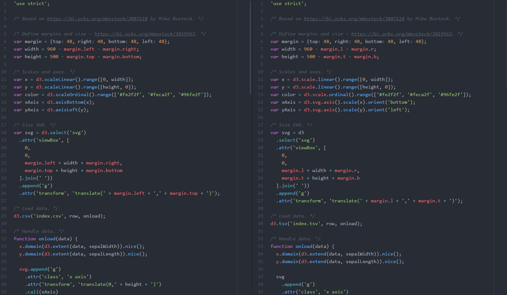

# Debugger

## Bugs i've fixed

### First

The first thing I fixed was the faulty data link in the JavaScript file.
`d3.tsv('index.tsv', row, onload);`

to

`d3.csv('index.csv', row, onload);`

### Next

Next I fixed the "width" and "height" variables by correcting the margin errors:

`var width = 960 - margin.l - margin.r;`
`var height = 500 - margin.t - margin.b;`

to

`var width = 960 - margin.left - margin.right;`
`var height = 500 - margin.top - margin.bottom;`

This margin error had to be fixed at several points throughout the JavaScript-file, such as the SVG viewBox (which uses margins as values), and a 'translate()'.

Next I changed:

``x.domain(d3.extend(data, sepalWidth)).nice();``
``
y.domain(d3.extend(data, sepalLength)).nice();``

to

``x.domain(d3.extent(data, sepalWidth)).nice();``
``y.domain(d3.extent(data, sepalLength)).nice();``

The main difference being that 'd3.extend' does not exist and is supposed to be 'd3.extent'

### d3 V4

Last but not least, I switched from d3 V3 to d3 V4.
First, I changed the d3 JavaScript source in the html file to be V4 instead of V3:

``

 to

``

After that, I had to change a couple of attributes to be compatible with V4, such as `d3.scale.linear` to `d3.scaleLinear` and `d3.scale.ordinal` to `d3.scaleOrdinal`
I changed the "xAxis" and "yAxis" like so:

`var xAxis = d3.svg.axis().scale(x).orient("bottom");`
`var yAxis = d3.svg.axis().scale(y).orient("left");`

to

`var xAxis = d3.axisBottom(x);`
`var yAxis = d3.axisLeft(y);`

And last I backspaced some enters and added a black fill to the text in the css file to make the axis labels show up (thanks Sebas!)

Before and after (Left being after):

