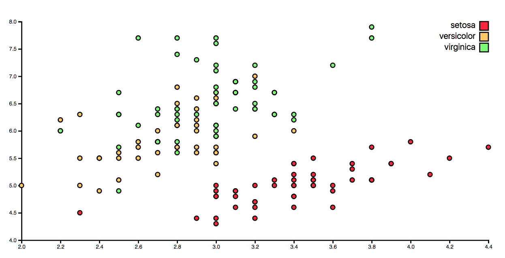

# Debug
De debug van een grafiek.

## Background
Een aantal files gedebugged, waaronder een JS, CSS, CSV en HTML file. Ook heb ik achteraf aanpassingen gemaakt waardoor de nieuwste versie van d3 geimplimenteerd is.

## Data
Op de website zie je een scatter grafiek staan. Ik weet niet waar de data precies over gaat maar er zijn drie verschillende variabelen gemeten.

## Features
**Original work:** [link](https://github.com/mbostock)

   * d3.scale.linear
   * d3.scale.ordinal
   * d3.svg.axis
   * d3.extent
   * d3.csv

## Fixes

**JAVASCRIPT**
* margin.l veranderd in .left, .r in .right, .b in .bottom, .t in .top
* bij viewbox de array achter elkaar gezet ipv onder elkaar met enters
* semicolon toegevoegd op regel 23 
* regel 22 aangepast ')')
* regel 45 quotes weggehaald bij yAxis

**HTML**
* Structuur aangepast, <head> toegevoegd, <body> afgemaakt, quotes achter =‘jes gedaan.
* <meta charset=utf8> veranderd in =“UTF-8”
* bij de shortcut icon heb ik de semicolon weggehaald aan het einde.
* Meta name content scale veranderd naar 1.0
* juiste stylesheet gelinked.
* scripts onder body gezet.

**CSS**
* Fonts tussen “” gezet.
* svg: width: 100vw en height: 100vh
* axis path fill:none ipv fill:no

**D3 NAAR V4**
* i.p.v. scale.linear scaleLinear
* i.p.v. axis.bottom axisBottom
* i.p.v. axis.left axisLeft

## License
GPL-3.0 © Titus Wormer

.
