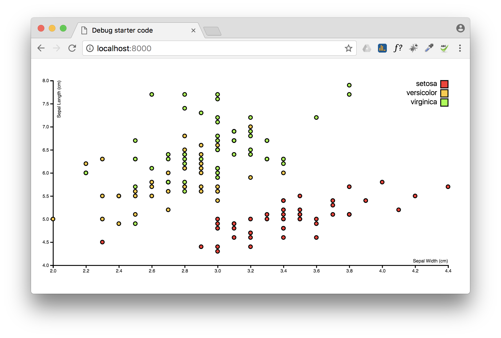

# debugger; homework assignment

## Short description
This assignment was giving to us during the second class of Front-end development 3. The teacher gave us some broken code, with mistakes inside the HTML, CSS and Javascript. 

## Deeper description
After downloading the files and starting a local server for the console to start I started debugging and looking for mistakes in the code. In the beginning it did took me a while to get started, (only the .CSV mistake was quite obvious to me) but after a while I got everything working.

### Debugged
After starting the server I saw an empty white screen with two errors in the console. The first error was about the TSV file that couldn't be found, so I changed the data path to the .CSV file. After that I changed the d3.extend function to d3.extent, after doing this I got some result on my screen. Then I changed the D3v3 to D3v4 so I could change the faults of scale.linear to scaleLinear, as showed in the presentation of the second class. After looking around for a longer period of time I found out that the margin.l, margin.r, margin.t and margin.b had to be changed to their full names. After this I added a color to the <text> element in the CSS so the Y- and X-asis have their own labels. 

## License
Copyright (c) 2017 [@tiicotaco](https://github.com/tiicotaco)
