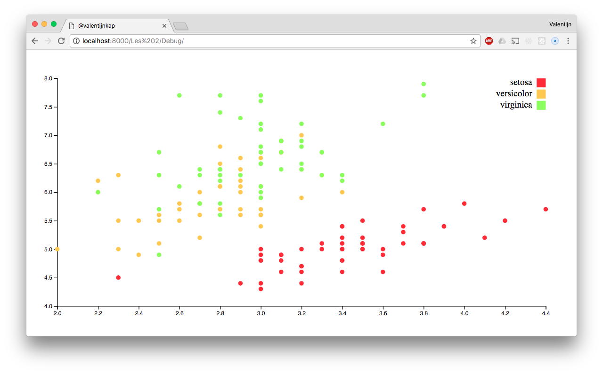

# Scatter plot

For a assignment from this course i had to fix some errors with this scatter plot to make it work again. After I fixed the bugs I had to change the d3 version to v4. 

## Fixed bugs
The bugs I fixed:

* Some 404 errors. The path to the .css and .js files where incorrect.
* Some functions like [extent()](https://github.com/d3/d3-3.x-api-reference/blob/master/Arrays.md#d3_extent) where not spelled correct.
* I had to rewrite some functions that work different in d3.v4.

## License

GPL-3.0 © Valentijn Kap

