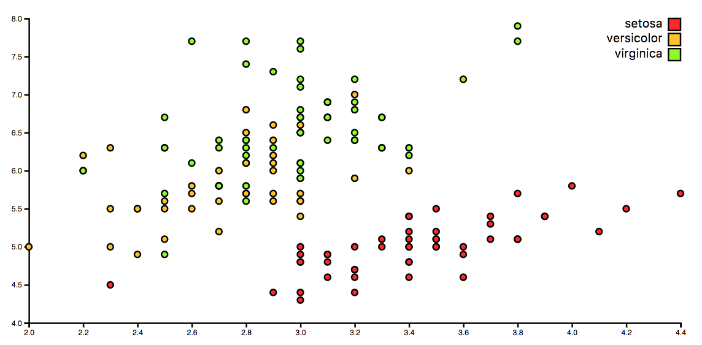

# Bugs

[An assignment](https://github.com/cmda-fe3/course-17-18/tree/master/site/class-2/debug) to fix some bugs that @wooorm made.

## Background

This assignment is to work on bugs and fix them. Within working in your style and rework the code from `d3.v3.js` to `d3.v4.js`.




## Bugs Fixed

-   margin left top right bottom
-   extent fix
-   css 100h en 100w fix
-   `d3.v3` to `d3.v4`
-   refactor `d3.scaleLinear()`
-   refactor `d3.scaleOrdinal()`
-   refactor `d3.extent()`
-   refactor `d3.axisBottom() or d3.axisLeft()`

### Style Used

I use single quotes for strings and every new piece of code gets a new line (for readability). I close every line of code but keep the DRY _(Don't Repeat Yourself)_ effect in tact.

For multiple variables I end on the latest line (in case you want to add more just `,` +  <button>enter</button> and add another one).

The next example you see how I use a function. array and loop.
*   New line on every new entry in the array (same for objects).
*   Close the array on a line of his own.
*   Loop on the same line.
*   Code to execute on the next.

```js
function myStyle() {
  var arrayColors = [
    '#ed9b50',
    '#ffb91b',
    '#5b85ff',
    '#8c63d9',
    '#dbe5ed',
    '#4ebc6b',
    '#f54784',
    '#43c5e5',
    '#46c999'
  ];

  for (var i = 0; i < arrayColors.length; i++) {
    console.log(arrayColors[i], 'colors');
  };
};
```

### features

[**d3 API**](https://github.com/d3/d3/blob/master/API.md)
-   [`d3.axisBottom() or d3.axisLeft()`](https://github.com/d3/d3-axis/blob/master/README.md)
-   [`d3.scaleOrdinal()`](https://github.com/d3/d3-3.x-api-reference/blob/master/Ordinal-Scales.md#ordinal)
-   [`d3.extent()`](https://github.com/d3/d3-array/blob/master/README.md#extent)
-   [`d3.scaleLinear()`](https://github.com/d3/d3-scale/blob/master/README.md#scaleLinear)

### License

[The chart @wooorm used](https://bl.ocks.org/mbostock/3887118) is made by @mbostock (GPL-3.0).
The [The donut chart @wooorm](https://github.com/cmda-fe3/course-17-18/tree/master/site/class-2/debug) is made by @wooorm (GPL-3.0).

[GPLv3](https://choosealicense.com/licenses/gpl-3.0/) Vincent Kempers 👨🏽‍💻
