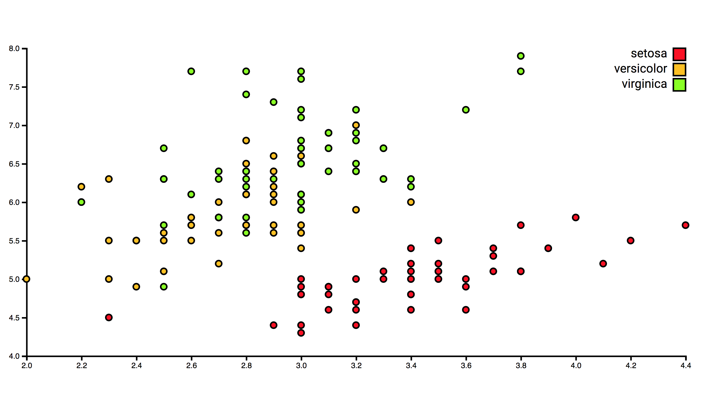

# Bug fixes



## Description:
A simple responsive scatter plot visualising the dimensions of sepals and petals of various iris flowers.
The code contained a couple of bugs and errors, which I had to fix. The following changes were made:

## Changes:

### HTML:

Within the HTML the script src linking to the current D3 version had to be changed from v3 to v4.

**From:**
`<script src="https://d3js.org/d3.v3.min.js"></script>`


**To:**
`<script src="https://d3js.org/d3.v4.min.js"></script>`

### CSS:

The CSS contained two syntax errors:

**From:**
```svg {
  width: 100w;
  height: 100h;
}

.axis path {
  fill: no;
}
```

**To:**
```svg {
    width: 100vw;
    height: 100vh;
}

.axis path {
    fill: none;
}
```

### JS:
First of all, I fixed a syntax error surrounding the margins.

**From:**
```
var margin = {top: 48, right: 48, bottom: 48, left: 48};
var width = 960 - margin.l - margin.r;
var height = 500 - margin.t - margin.b;
```

**To:**
```
var margin = {
    top: 48,
    right: 48,
    bottom: 48,
    left: 48
};

var width = 960 - margin.left - margin.right;
var height = 500 - margin.top - margin.bottom;
```

Next up, I had to change `.tsv` to `.csv`, because that is the format of the data file.

**From:**
`d3.tsv('index.tsv', row, onload);`

**To:**
`d3.csv('index.csv', row, onload);`

A syntax error once again:

**From:**
```x.domain(d3.extend(data, sepalWidth)).nice();
  y.domain(d3.extend(data, sepalLength)).nice();
```

**To:**
```x.domain(d3.extent(data, sepalWidth)).nice();
    y.domain(d3.extent(data, sepalLength)).nice();
```

Lastly, changing the D3 version from v3 to v4, included changing the following code:

**From:**
```var x = d3.scale.linear().range([0, width]);
var y = d3.scale.linear().range([height, 0]);
var color = d3.scale.ordinal().range(['#fe2f2f', '#feca2f', '#96fe2f']);
var xAxis = d3.svg.axis().scale(x).orient('bottom');
var yAxis = d3.svg.axis().scale(y).orient('left');
```

**To:**
```var x = d3.scaleLinear().range([0, width]);
var y = d3.scaleLinear().range([height, 0]);
var color = d3.scaleOrdinal().range(['#fe2f2f', '#feca2f', '#96fe2f']);
var xAxis = d3.axisBottom(x);
var yAxis = d3.axisLeft(y);
```

## License:
GPL-3.0 &copy; Mike Bostock
