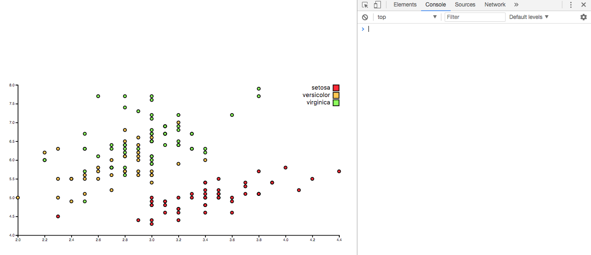

# Debug
De code debuggen

## Background
Code van https://github.com/zezavdh/course-17-18/tree/bar/site/class-2/debug kopiëren en hier de fouten uithalen totdat er in de console geen errors meer staan. Wanneer dit gelukt is, de code upgraden van d3@3 naar d3@4.

## Data
X-as en y-as aangegeven door middel van getallen. Ticks worden weergegeven. Er is een legenda, deze bevat: rood = setosa, oranje = versicolor, groen = virginic. In het CSV bestand zijn er vijf kolommen, dit zijn de verschillende kleuren en de getallen die erbij horen. Zo komen de puntjes op de juiste plek in de grafiek te staan.

## Features
Code van https://github.com/zezavdh/course-17-18/tree/bar/site/class-2/debug

## Debugs gefixed

### HTML
- De opmaak goed gemaakt door middel van !*tab* in te toetsen en hier de regels netjes in te zetten.
- Quotes toegevoegd aan de stylesheet en javascript links.

### CSS
- De vw en vh aangepast in het SVG attribuut.
- Fonts netjes neergezet en '' eromheen gezet.
- axis path fill:no; veranderd naar fill:none;

### JS
- Viewbox op regel 20, alles op een lijn gezet inplaats van onderbroken door enters
- Margins.l veranerd naar het hele woord dus: margin.l wordt margin.left. Hetzelfde geldt voor top, right en bottom.
- Op regel 25 .tsv veranderd naar .csv
- Svg regel 54 'unexpected end' er een ; achter gezet.

### d3@3 naar d3@4
-  in de html gezet.
- Scale and axes Linear met hoofdletter en punt weghalen dat wordt: d3.scaleLinear()
- Hetzelfde geldt voor d3.scaleOrdinal eronder. Punt weggehaald en hoofdletter O van gemaakt.
- Bij de xAxis en yAxis heb ik de scale en orient weggehaald. Dit moet nu d3.axisBottom(x); zijn.

## License
GPL-3.0 © Titus Wormer

