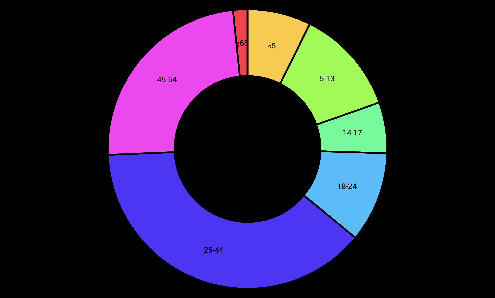

# Class 2: Style

In this assignment I've learned to refactor and reformat code.

## Background
For this assignment I had to reformat code to make a donut chart in my own style. 

The style choices I made in the code were as following:
* Moved the var to the beginning of the js.
* Devided the js document with tabs so functions start in the far left.
* Broke up the values of the "colors" in the var so they become more readabl;e.
* Used tabs to format each element within a var or function to their own position horizontally.

## Data
The data in this file is completely made up for learning purposes.

## Features
### D3
* [scaleOrdinal](https://github.com/d3/d3-scale#scaleOrdinal) - Constructs a new ordinal scale with an empty domain and the specified range.
* [arc](https://github.com/d3/d3-shape/blob/master/README.md#_arc) - Generate an arc for the given datum.
* [pie](https://github.com/d3/d3-shape/blob/master/README.md#pie) - Create a new pie generator.
* [select](https://github.com/d3/d3-selection/blob/master/README.md#selection_select) - Select a descendant element for each selected element.

## License

MIT © Lucas Berghoef
