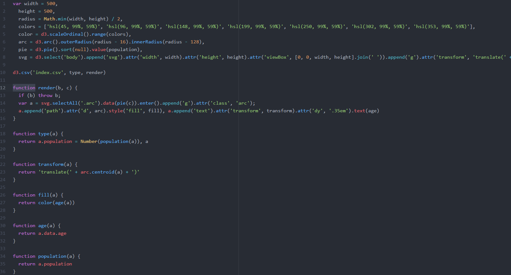

# Style

## Style choices

### Why I format how I format

First, I declarate all the variables I need. I tab every variable after the first one once.

I tab every line once every scope I go deeper in a function.

