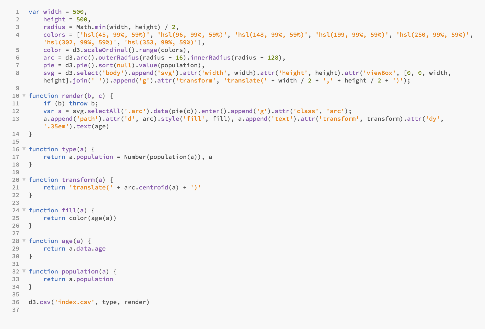

# Style opdracht
Voor deze opdracht heb ik code aangeleverd gekregen alleen was deze code niet netjes opschoont met spatie's en enters.
Aan mij de opdracht om deze code weer netjes te maken zodat hij beter leesbaar is en ontbrekende karakters toe te voegen waar nodig. Deze heb ik bijv. kunnen vinden in de css waar er op sommige plekken niet goed met een ; is afgelosten.
Daarnaast heb ik de plaats van de variabele in de javascript boven gezet in plaats van beneden, omdat een variabele meestal vanaf het begin wordt gemaakt.

## Licentie
GPL-3.0 © Titus Wormerx
