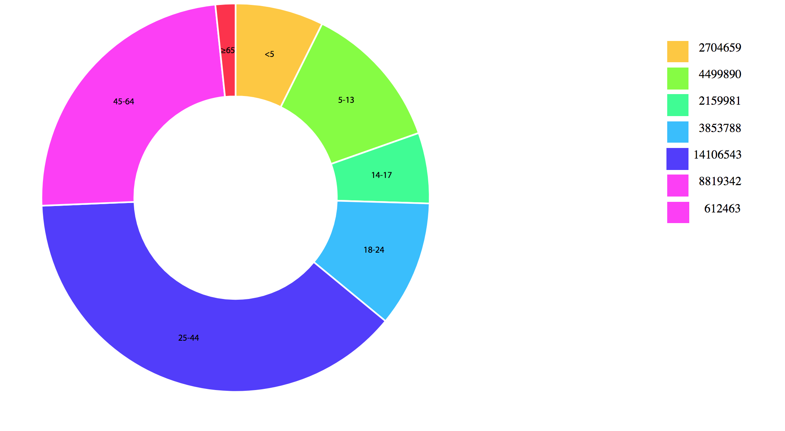

# Donut Chart
For this assignment I copied al the files to my own computer and opened it with my code editor. First of all I checked the CSS file and adjusted some things so it was easier to read.
Then i adjusted the index.js file with comments en replaced the variables and functions.

After that I made an unordered list in HTML tot serves as a legenda.

## Preview

## License

MIT @ Björn Völkers
