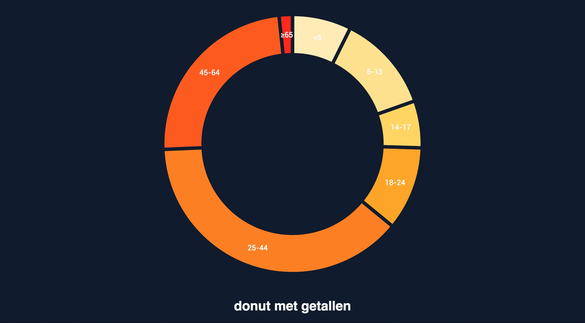

#### Donut chart
 #### A simple responsive donut chart visualising the populations of various age groups with pretty colours based on a bl.ock by @mbostock (GPL-3.0).

  >Files in this project:
  > * index.csv
  > * index.css
  > * index.html
  > * preview.jpg
  > * index.js

 ##### Background
 I made this donut as homework for the second lecture of Front end 3. The instruction was to clean up the code and make it your own preferred style.

 ##### Data
 The chart visualizes the the populations of various age groups.

 ##### Style
 I made changes to the index.css file with beautify. I made changes in the index.js with beautify and seperated some parts by hand, also added semicolons for clarity.

 ##### Features
 * [d3-array](https://github.com/d3/d3-array#api-reference)
 * [d3-axis](https://github.com/d3/d3-axis#api-reference )
 * [d3-request](https://github.com/d3/d3-request#api-reference)
 * [d3-scale](https://github.com/d3/d3-scale#api-reference)
 * [d3-selection](https://github.com/d3/d3-selection#api-reference)

 ##### License
 GPL-3.0 © Sebas Schmidt
