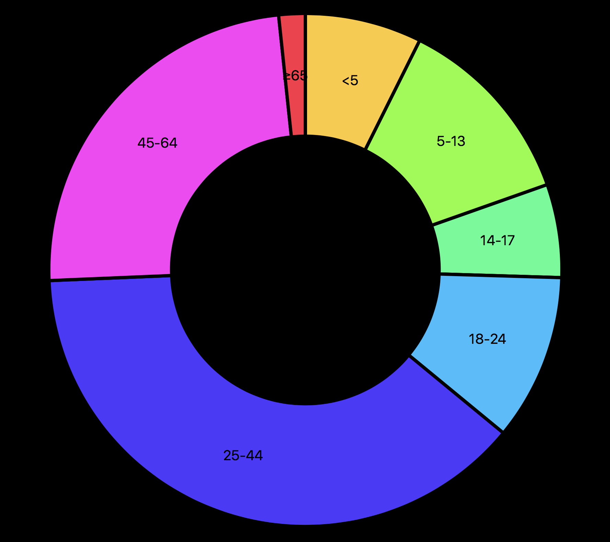

# Style homework assignment

### Short description
Re-order and customize the code given by the teacher.

### Deeper description
After downloading the code from the Github website I first re-ordered everything. All the code was in single lines.. To make it more clear I added enters and space inbetween each line to make the code more understandable. I did this to all given files (index.csv, index.css, index.html and index.js), after doing this i tried understanding the code and adding comment lines to the index.js file of the code that I was able to understand. 

### Data explanation
The data which was used in this assignment is a population of a country, devided by their age category. 
We used the follwed dataset:

| Age        	| Population    |
| ------------- |:-------------:|
| <5		    | 2704659		|
| 5-13		    | 4499890		|
| 14-17		    | 2159981		|
| 18-24		    | 3853788		|
| 25-44		    | 14106543		|
| 45-64		    | 8819342		|
| >65		    | 612463		|

### Features
d3.number()
d3.centroid()
d3.range()
d3.outerRadius()
d3.innerRadius()
d3.sort()
d3.value()
d3.append()
d3.attr()
d3.join()
d3.csv()

Copyright (c) 2017 [@tiicotaco](https://github.com/tiicotaco)
