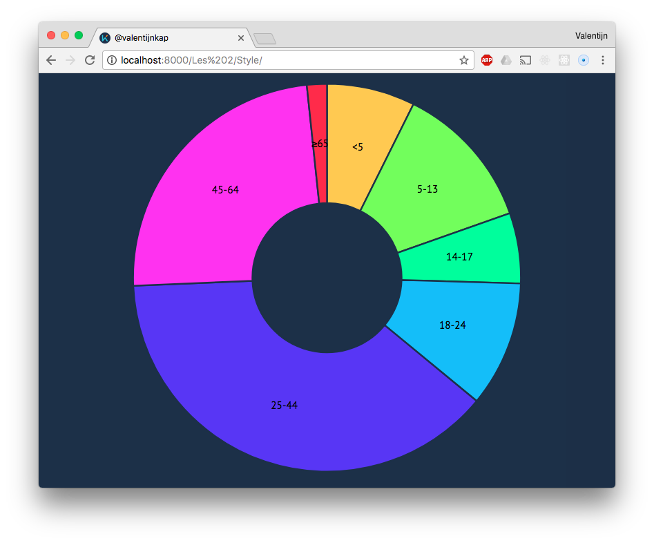

# Donut chart

This is a copy of the donut chart from [Titus Wormer](https://github.com/valentijnkap/course-17-18/tree/master/site/class-2-style/wooorm). This assignment challanged me to create my own labels and style of code. 

## Changes

The things I changed from the copy are:

* I changed the .js code so it would fit the [Standard JS](https://github.com/standard/standard) code.
* I changed the background color and font-family in the css so it fits my preferences.
* I added some basic tags to the html file. It wasn't valid html5.

## License

GPL-3.0 © Valentijn Kap