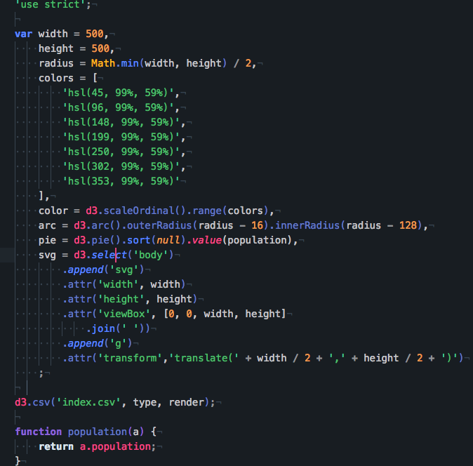

# Style

In [the assignment style](https://github.com/cmda-fe3/course-17-18/blob/master/class-2.md#style), I refactored the minified code from [the responsive 'donut' chart @wooorm](https://github.com/cmda-fe3/course-17-18/tree/master/site/class-2/style) to my style of coding.

## Background

I have rewritten the code to find and apply my style in writing code. This assignment trains this.

End result:




### my "Style Guide"

I use single quotes for strings and every new piece of code gets a new line (for readability). I close every line of code but keep the DRY _(Don't Repeat Yourself)_ effect in tact.

For multiple variables I end on the latest line (in case you want to add more just `,` +  <button>enter</button> and add another one).

```js
var text = 'string',
    aNumber = 5,
    boolean = true
    ;
```

The next example you see how I use a function. array and loop.
*   New line on every new entry in the array (same for objects).
*   Close the array on a line of his own.
*   Loop on the same line.
*   Code to execute on the next.
*   _For some reason interested about the colors I picked check [dash-syntax](https://github.com/cpsdqs/dash-syntax)_

```js

function myStyle() {
  var arrayColors = [
    '#ed9b50',
    '#ffb91b',
    '#5b85ff',
    '#8c63d9',
    '#dbe5ed',
    '#4ebc6b',
    '#f54784',
    '#43c5e5',
    '#46c999',
  ];

  // for (var i = 0; i < arrayColors.length; i++) {
  //   console.log(arrayColors[i]);
  // };
};
```

Last example: This one is from this file.

Every `.attr` or `.join` is on a new line, and spaces after `,`.

```js

svg = d3.select('body')
    .append('svg')
    .attr('width', width)
    .attr('height', height)
    .attr('viewBox', [0, 0, width, height]
        .join(' '))
    .append('g')
    .attr('transform','translate(' + width / 2 + ',' + height / 2 + ')')
;

```
### License

[The chart @wooorm used](https://bl.ocks.org/mbostock/3887193) is made by @mbostock (GPL-3.0).
The [The donut chart @wooorm](https://github.com/cmda-fe3/course-17-18/tree/master/site/class-2/style) is made by @wooorm (GPL-3.0).

[GPLv3](https://choosealicense.com/licenses/gpl-3.0/) Vincent Kempers
