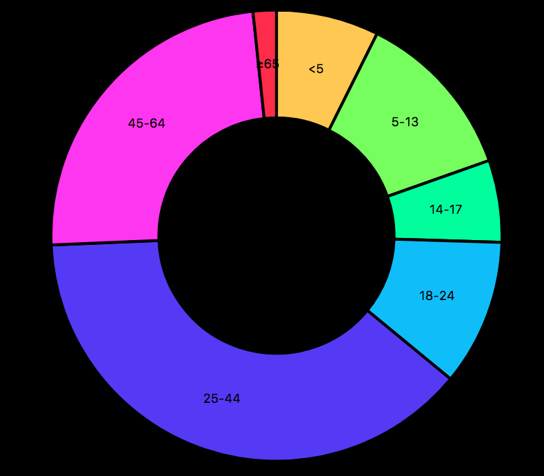

# Donut Chart
Code laten werken

## Background
Een bestaande chart werkend laten maken door de code netjes neer te zetten en zo de fouten eruit te kunnen halen.

## Data
- Ik heb de CSS netjes onder elkaar gezet. 
- Fonts aangepast zodat ze werken. 

## Features
Ik heb mijn code gekopieërd van https://github.com/zezavdh/course-17-18/tree/bar/site/class-2/style en dit aangepast.

## License
GPL-3.0 © Titus Wormer

