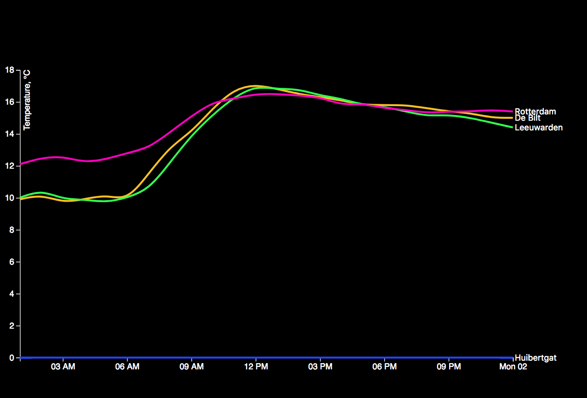

# Cleaning data
###### cleaning a data file to create a line chart

## Background
First i downloaded the index.html and index.txt from github. The next thing i did was downloading the data 
from [knmi](http://projects.knmi.nl/klimatologie/uurgegevens/selectie.cgi) site. I've picked out 4 weather station (De bilt, Rotterdam, Leeuwarden and Huibergat) and a date (Oktober 1, 2017) to display on the chart.
Then i started cleaning the data:
1. removed the #
2. removed header
3. removed the spacing
4. parsing the time
5. parsing the rows
6. mapping the data
7. pushing to var places
8. slicing the array and nest it.

The most diffucult problem was nesting the array to match example.json. I tried to do it mannualy, but that didnt work. Later i found out that there is a d3.nest function.
To help me get it correct i've used the following links:

* [Group data](http://learnjsdata.com/group_data.html)
* [Renaming key](https://stackoverflow.com/questions/37172184/rename-key-and-values-in-d3-nest)

The huibertgat dataset didnt have any temperatures measured, so the line is flat.

## Lincense

GNU @ basrikkers

