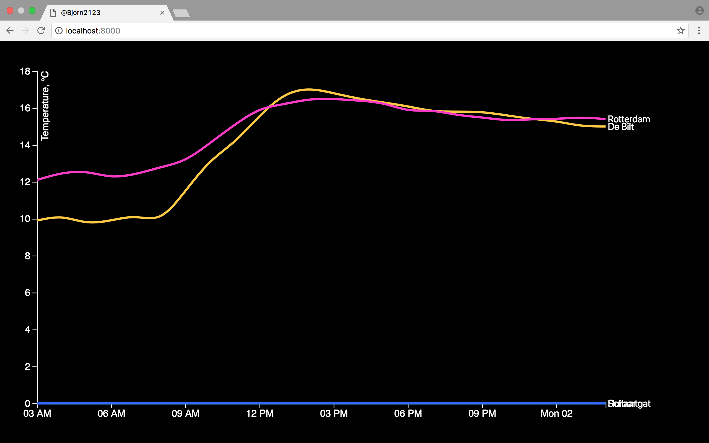

# The clean Assignment

For this assignment i copied the files made by @wooorm and opened them in my text editor. First of all i went to the KNMI website and downloaded data of four weather stations

## The code i used to clean the file

I opened the slides and copied the code that @wooorm axplained. 

I used the following codes:

```js
d3.text('index.txt')
  .get(onload)

function onload(err, doc) {
  if (err) {
    throw err
  }

  console.log(doc) 
  }
```
After that I used the following code to correctly parse the text:
```js
.mimeType('text/plain;charset=iso88591')
```
After follwiing the slides I made this line of code:

```js
var header = doc.indexOf('STN,YYYYMMDD')
        var end = doc.indexOf('\n', header)
        doc = doc.slice(end).trim()
        doc = doc.replace('#', '')
        doc = doc.trim()
        doc = doc.replace(/ +/g, '')
        var parseTime = d3.timeParse("%Y%m%dT%H:%M:%S.%L%Z")
        var places = d3.csvParseRows(doc, map)
        
          function map(d) {
            return {
                date: parseTime((d[1].concat('T', d[2], ':00:00.000Z'))),
                temperature: (Number(d[7]) / 10),
                name: knmiCodes[d[0]]
            }
        }

 ```
 
 Until now it was quite easy. But I found the next steps realy hard and therefor I used [http://learnjsdata.com/group_data.html](http://learnjsdata.com/group_data.html) & [http://bl.ocks.org/phoebebright/raw/3176159/](http://bl.ocks.org/phoebebright/raw/3176159/)
 for explanation and useful codes.
 
 Using these sites i made the following code line:
 
 ```js
 places = d3.nest()
            .key(function (d) { 
                return d.name;
            })

        .entries(places)
            .map(function (group) {
                return {
                    name: group.key,
                    values: group.values
                }
            });

```

### Preview


## License

MIT @Björn Völkers


