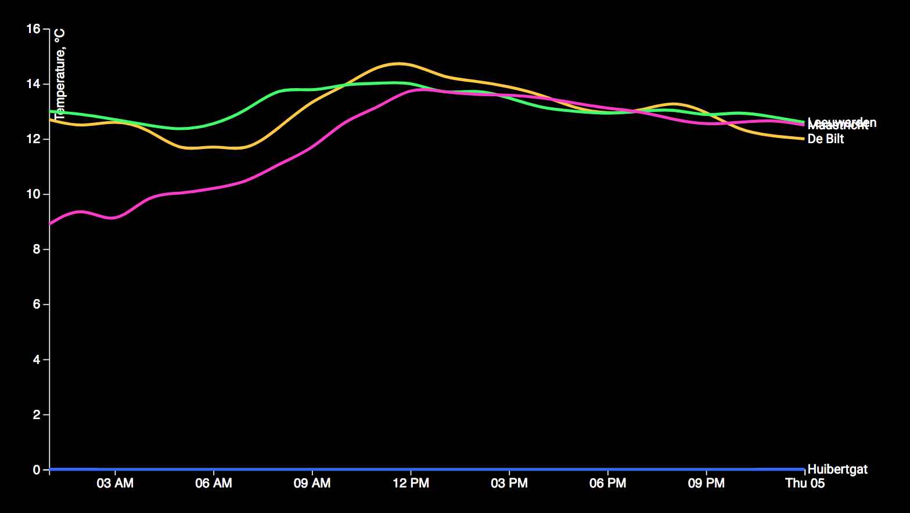

## Assignment:
Data cleaning assignment, used a lot of comments in my code to describe what the code does.

## Summary:
First I made sure the data was loaded. Then by using indexOf I identified which part of the data I needed and trimmed the rest of. Replaced the spaces and used commas to separate the values.
Set a parseTime variable to interpret the date/time column and return the data with a correct format. Return all the data in objects and group all the values with the same name together.

## Features
* [d3.permute - indexOf, slice, replace, trim](https://github.com/d3/d3-array/blob/master/README.md#permute)
* [d3.timeFormat - timeParse](https://github.com/d3/d3-array/blob/master/README.md#permute)
* [d3.csvParseRows - concat](https://github.com/d3/d3-dsv/blob/master/README.md#csvParseRows)
* [d3.nest - key, entries, map](https://github.com/d3/d3-collection/blob/master/README.md#nest)

### Quick notes:
* timeParse 
%Y		= Year with century as a decimal number.
%m		= Month as a decimal number [01,12].
%dT		= 
%H:		= Hour (24-hour clock) as a decimal number [00,23].
%M:		= Minute as a decimal number [00,59].
%S.		= Second as a decimal number [00,61].
%LZ		= milliseconds as a decimal number [000, 999].


d3.max gives back the highest value.
```
var theMax = d3.max([1,2,20,3]);
console.log(theMax);		=> 20
```


Use d3.csv to convert it into an array of objects
```
d3.csv("/data/cities.csv", function(data) {
  console.log(data[0]);
});
```

In the case of numbers. When loading CSVs and other flat files, you have to do the type conversion.
```
d3.csv("/data/cities.csv", function(data) {
  data.forEach(function(d) {
    d.population = +d.population;
    d["land area"] = +d["land area"];
  });
  console.log(data[0]);
});
```

Dot notation is a useful way to access the properties of these data objects. However, if your headers have spaces in them, then you will need to use bracket notation as shown. This can also be done during the loading of the data, by d3.csv directly. This is done by providing an accessor function to d3.csv, who's return value will be the individual data objects in our data array.

```
d3.csv("/data/cities.csv", function(d) {
  return {
    city : d.city,
    state : d.state,
    population : +d.population,
    land_area : +d["land area"]
  };
}, function(data) {
  console.log(data[0]);
});
```

Map takes an array and produces another array which is the result of the callback function being executed on each element in the array.
```
var smallData = data.map(function(d,i) {

  return {
    name: d.city.toUpperCase(),
    index: i + 1,
    rounded_area: Math.round(d.land_area)
  };
});
console.log(data[0]);
console.log(smallData[0]);
```

## License

GPL-3.0 © Jamie Jansen
