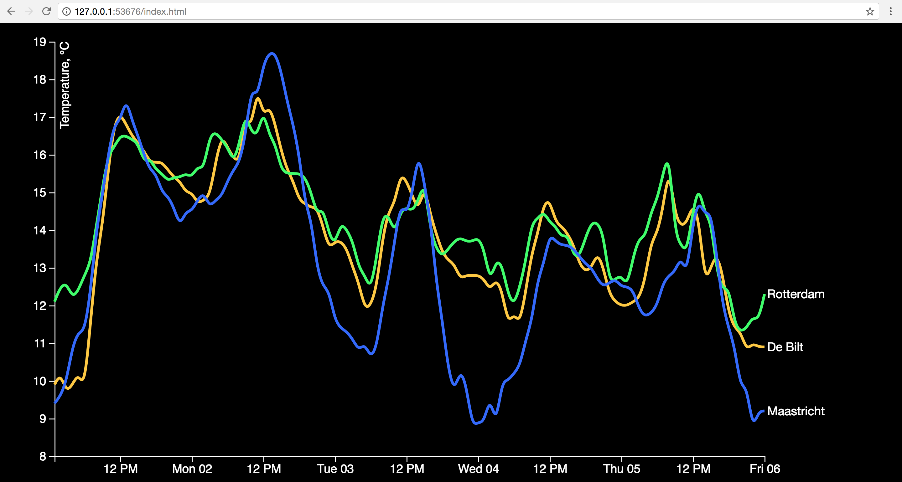

# Cleaning the code

We started with a simple Chart without any data.
For this assignment we had to load in the data and clean it so it can be used in the chart.



## How

I followed the first steps from the slides:
1. Get the part of the data u need (without intro)

```
var header = doc.indexOf("STN,YYYYMMDD")
var end = doc.indexOf("\n", header)
doc = doc.slice(end).trim() 
```

2. Replace the empty spacing

```
doc = doc.replace(/ +/g, "")
doc = doc.replace("#", "").trim()
```
3. Parse the time en places

```
d3.timeParse('%Y%m%dT%H:%M:%S.%LZ')
var places = d3.csvParseRows(doc, map)
```

4. Change the function map

```
function map(d) {
            if (d[7] == "") {
                return
            }
            return {
                date: parseTime((d[1].concat("T", d[2], ':00:00.000Z'))),
                temperature: (Number(d[7]) / 10),
                name: knmiCodes[d[0]]
            }
        }
```

5. Add data to places (nest) 

```
places = d3.nest().key(function (d) {
                return d.name;
            })
            .entries(places)
            .map(function (setdata) {
                return {
                    name: setdata.key,
                    values: setdata.values
                }
            });

```

## Features

``parseRows``
``timeParse``
``nest``

## License

MIT @ Kevin Goldstein


