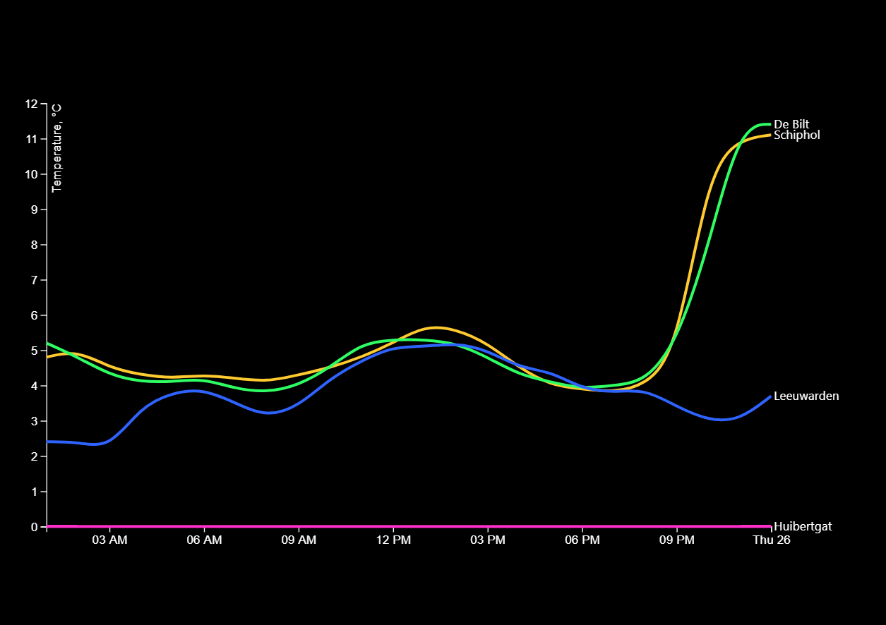

# My spent hours
This is a multi-series line chart visualising the temperature of several places in the Netherlands. The [chart](https://github.com/cmda-fe3/course-17-18/tree/master/site/class-3/clean) was made by [@titus](https://github.com/wooorm) and original based on [**bl.ock**](https://bl.ocks.org/mbostock/3884955) by [@mbostock](https://github.com/mbostock)(GPL-3.0). 

## Background 
For my first assignment of class 3 I learned load, clean, and transform data so it can be used in a line chart.

### How I cleaned the data
1. I first I assigned the type of the file `index.txt`.
2. I had a quick look into the file to see if I saw missing signs (If this was the situation I had to find out in what kind of charset the file was written.)
3. Next I looked at the structure of the file and saw that:
    - The first section of the file is an introduction about the file. This goes till line 36.
    - After the introduction there is # with a white space line 37.
    - After the white space cones the data, line 38 until 133.
    - The data is Comma-separated values with spaces in between. 
4.  In my `index.html` file in my script I created a `var header` where I assigned it to `doc.indexOf('STN,YYYYMMDD')`. 
    - To check the result I used `console.log(doc)`. 
    - Because this was a long data I used then `// console.log(doc.slice(0,500))` to get a short version of the doc. 
5. After I created a `var end` and assigned it to a white space (enter).
    - This to throw away the white space that is not needed. 
6. At this step I rewrote the data to a better structure. 
    - To do that I used `csvParseRows` and a `function map(d)`.
    - I used `console.log(data[0])` to help me see what I was doing to the structure.
6. I assigned the new doc structure to the `var places`.
    - with `d3.nest()` I grouped the data so that the data was successful able to show in the graph.

## Data 
The data was obtained from the [KNMI website](https://projects.knmi.nl/klimatologie/uurgegevens/selectie.cgi).

It was a `.txt` file that I turned into readable data.
The data set from KNMI was about the weather in the following Weather stations:
 * The Bilt
 * Schiphol
 * Leeuwarden
 * Huibertgat

For the graph I used the following columns of data:
 +- STN - Station code
 +- YYYYMMDD - Date
 +- HH - Hour
 +- T - Temperature

## Features 
The chart employs conventional margins and a number of D3 features:

*   [`d3-array`](https://github.com/d3/d3-array#api-reference)
    — `d3.extent`
    — Array statistics
*   [`d3-axis`](https://github.com/d3/d3-axis#api-reference)
    — `d3.axisBottom` and `d3.axisLeft`
    — Reference marks for scales
*   [`d3-request`](https://github.com/d3/d3-request#api-reference)
    — `d3.text`
    — Loading files
*   [`d3-scale`](https://github.com/d3/d3-scale#api-reference)
    — `d3.scaleTime`, `d3.scaleLinear`, `d3.scaleOrdinal`, and
    `d3.schemeCategory10`
    — Position encodings
*   [`d3-selection`](https://github.com/d3/d3-selection#api-reference)
    — `d3.select`
    — Select elements
*   [`d3-shape`](https://github.com/d3/d3-shape#api-reference)
    — `d3.line` and `d3.curveBasis`
    — Graphical primitives

## License 
[GNU General Public License](https://opensource.org/licenses/GPL-3.0), version 3 © Luisa Braga dos Santos
