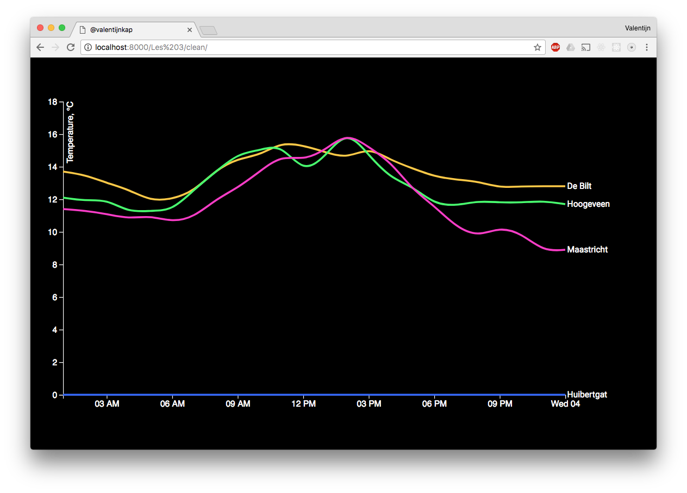

# Line chart

## Background
For this lesson I used a linechart from [Titus Wormer](https://github.com/cmda-fe3/course-17-18/tree/master/site/class-3/clean) to illustrate some temperature data from several places in the Netherlands. I picked some data from [knmi](http://projects.knmi.nl/klimatologie/uurgegevens/selectie.cgi) and used it. But before the line chart would work I had to clean it.

## How dit i do it?
Before I thit this assignment I followed a class where they explaind how to do it. I used that knowledge to start of. 

So the following code came from the lesson:

'''javascript
	var header = doc.lastIndexOf('#');
 	var end = doc.indexOf('\n', header);
  	doc = doc.slice(end).trim();
  	doc = doc.replace(/ +/g, '');
'''

After that i got stuck with the timeparse. I didn't knew witch format I had to use so someone helped me with that. By then I searched for [d3.nest](http://bl.ocks.org/phoebebright/raw/3176159/) and used it to make the chart work.

## Features that are used

* [d3.csvParseRows()](https://github.com/d3/d3-dsv/blob/master/README.md#csvParseRows)
* [d3.nest()](https://github.com/d3/d3-collection/blob/master/README.md#nest)
* [d3.timeParse()](https://github.com/d3/d3-time-format/blob/master/README.md#timeParse)

## License

[GPL-3.0](https://www.gnu.org/licenses/gpl-3.0.en.html) © Valentijn Kap