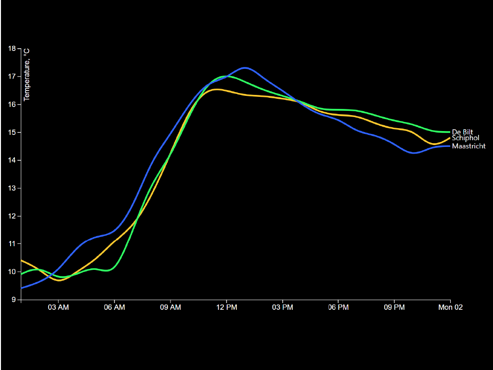

# Data cleaning

In this example I made sure all data I had to use was raw and didn't contain more than needed. I used a Line Chart based on a [`bl.ock`](https://bl.ocks.org/mbostock/3884955) by [**@mbostock**](https://github.com/mbostock) (GPL-3.0).

## Background

In this excercise I had to clean data from a raw source. I used the examples who where shown in the slide show. The difficult part for me was to show the data in an `places[]` array in the right order. In the end it worked with some help from the classmates and searching around on google. 

## Data

I used 'dirty' data from [`knmi.nl`](https://projects.knmi.nl/klimatologie/uurgegevens/selectie.cgi). It's weather info from one day in October.

## Features

*   [`d3-array`](https://github.com/d3/d3-array#api-reference)
    — `d3.extent`
    — Array statistics
*   [`d3-axis`](https://github.com/d3/d3-axis#api-reference)
    — `d3.axisBottom` and `d3.axisLeft`
    — Reference marks for scales
*   [`d3-request`](https://github.com/d3/d3-request#api-reference)
    — `d3.text`
    — Loading files
*   [`d3-scale`](https://github.com/d3/d3-scale#api-reference)
    — `d3.scaleTime`, `d3.scaleLinear`, `d3.scaleOrdinal`, and
    `d3.schemeCategory10`
    — Position encodings
*   [`d3-selection`](https://github.com/d3/d3-selection#api-reference)
    — `d3.select`
    — Select elements
*   [`d3-shape`](https://github.com/d3/d3-shape#api-reference)
    — `d3.line` and `d3.curveBasis`
    — Graphical primitives

## License

GPL-3.0 © Victor Zumpolle
