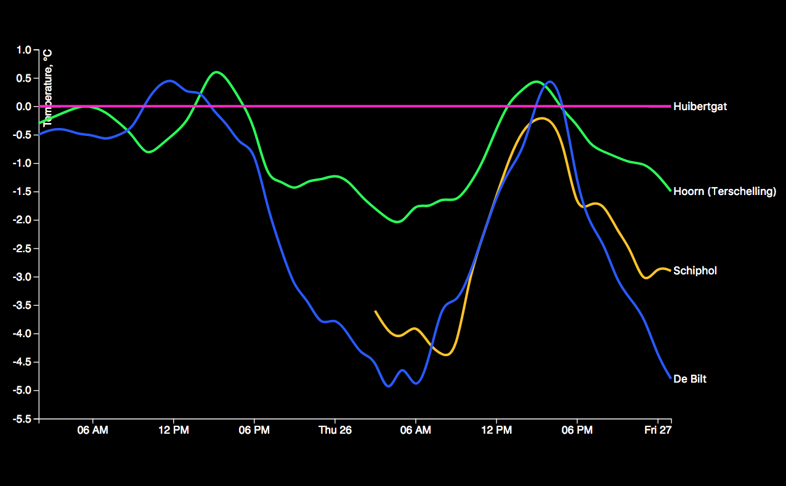

# Clean

[An assignment](https://github.com/cmda-fe3/course-17-18/tree/master/site/class-3/clean) to fix the the line chart!

## Background

This assignment is to work on the line chart that misses code to render the data from the text file. The data used is from the [knmi](https://projects.knmi.nl/klimatologie/uurgegevens/selectie.cgi). to make it work we needed to format the data like the [example.json](https://github.com/cmda-fe3/course-17-18/blob/master/site/class-3/clean/example.json) to make it work.



### Style Used

I use single quotes for strings and every new piece of code gets a new line (for readability). Keep it DRY _(Don't Repeat Yourself)_.

For multiple variables I end on the latest line (in case you want to add more just `,` +  <button>enter</button> and add another one).

The next example you see how I use a function. array and loop.  
*   New line on every new entry in the array (same for objects).
*   Close the array on a line of his own.
*   Loop on the same line.
*   Code to execute on the next.

```js
function myStyle() {
  var arrayColors = [
    '#ed9b50',
    '#ffb91b',
    '#5b85ff',
    '#8c63d9',
    '#dbe5ed',
    '#4ebc6b',
    '#f54784',
    '#43c5e5',
    '#46c999'
  ];

  for (var i = 0; i < arrayColors.length; i++) {
    console.log(arrayColors[i], 'color');
  }
}
```

### features

[**d3 API**](https://github.com/d3/d3/blob/master/API.md)
-   [`d3.axisBottom() or d3.axisLeft()`](https://github.com/d3/d3-axis/blob/master/README.md)
-   [`d3.scaleOrdinal()`](https://github.com/d3/d3-3.x-api-reference/blob/master/Ordinal-Scales.md#ordinal)
-   [`d3.extent()`](https://github.com/d3/d3-array/blob/master/README.md#extent)
-   [`d3.scaleLinear()`](https://github.com/d3/d3-scale/blob/master/README.md#scaleLinear)
-   [`d3.nest()`](http://bl.ocks.org/phoebebright/raw/3176159/)
-   [`d3.timeParse()`]()
-   [`d3.csvParseRows()`]()
-   [`d3.text()`]()
### License

[The chart @wooorm used](https://bl.ocks.org/mbostock/3884955) is made by @mbostock [(GPLv3)](https://choosealicense.com/licenses/gpl-3.0/).
The [The donut chart @wooorm](https://github.com/cmda-fe3/course-17-18/tree/master/site/class-3/clean) is made by @wooorm [(GPLv3)](https://choosealicense.com/licenses/gpl-3.0/).

[GPLv3](https://choosealicense.com/licenses/gpl-3.0/) Vincent Kempers 👨🏽‍💻
