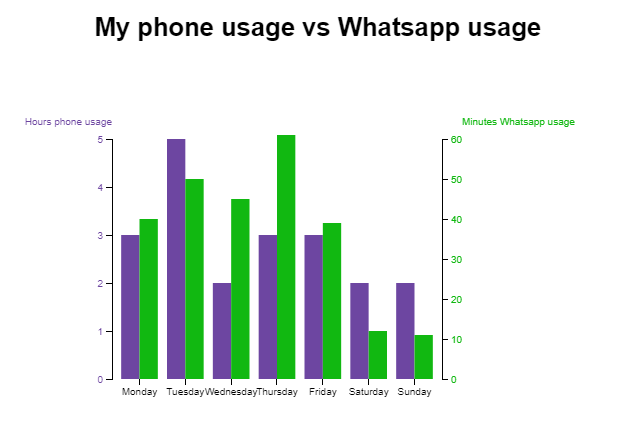

# My spent hours
This is dual scale bar chart visualising my usage of my phone vs the usage of Whatsapp. This chart was based on [Dual-scale-D3-Bar-Chart](https://github.com/liufly/Dual-scale-D3-Bar-Chart) made by [@liufly](https://github.com/liufly).



## Background 
For this assignment of class 3 I used a [static bar chart]((https://github.com/liufly/Dual-scale-D3-Bar-Chart)) as a base of a bar chart with d3-animations.

### Changes made

#### HTML:
* Gave it a basic HTML structure.
* Closed the `<body>` tag.
* Added a `<h1>` element with the title of my chart.

#### CSS:
* Changed the px units to `em`.
* Changed colors to hexa codes. 
* Added margin to the h1 element.

#### JavaScript:
* Wrote in comments a short explanation of what a block code does. 
* Changed the code to d3js v.4.
* Changed the data and text of the previous chart.
* Added a transition do the bars.
    ```
    .transition()
        .attr("height", function(d,i,j) { return height - y0(d.totaal); })
        .attr("y", function(d) { return y0(d.totaal); })
        .delay(function(d, i){
                return i * 500;
        })
        .duration(500)
        .ease(d3.easeBounce);
    ``` 
    - Each bar will show up in the screen after each other. 
    ```
    .delay(function(d, i){
        return i * 500;
    })
    ```
    - Added a hover effect to the bars. (`mouseover` and `mouseout`) 
    ```
    bars.selectAll("rect")
        .on("mouseover", function(d) {
            d3.select(this).style("opacity", .5);
        })
        .on("mouseout", function(d){
        d3.select(this).style("opacity", 1); 
        });
    ```
    - Used `.ease(d3.easeBounce);` to specify a ease.
     ```
     .ease(d3.easeBounce);
      ```

## Data 
The graph is made with my own collected data from a week time.

The data:
* Mobile usage in hours
* Whatsapp usage in minutes
* Days of the week

## Features 
The chart employs conventional margins and a number of D3 features:

*   [`d3-axis`](https://github.com/d3/d3-axis#api-reference)
    — `d3.axisBottom` , `d3.axisLeft` and `d3.axisRght`
    — Reference marks for scales
*   [`d3-request`](https://github.com/d3/d3-request#api-reference)
    — `d3.text`
    — Loading files
*   [`d3-scale`](https://github.com/d3/d3-scale#api-reference)
    — `d3.scaleLinear` and `d3.scaleOrdinal`
    — Position encodings
*   [`d3-selection`](https://github.com/d3/d3-selection#api-reference)
    — `d3.select`
    — Select elements
* [`d3.transitions`](https://github.com/d3/d3-transition)
    — Ease
*   [`d3.mouse`](https://github.com/d3/d3-selection/blob/master/README.md#selection_on)
    — `mousemove`
        Mousemove event triggers every time the mouse pointer is moved over the div element.
     — `mouseout`
         Mouseout event occurs when the mouse pointer is moved out of the div element

## License 
[MIT](https://opensource.org/licenses/MIT) © Luisa Braga dos Santos
