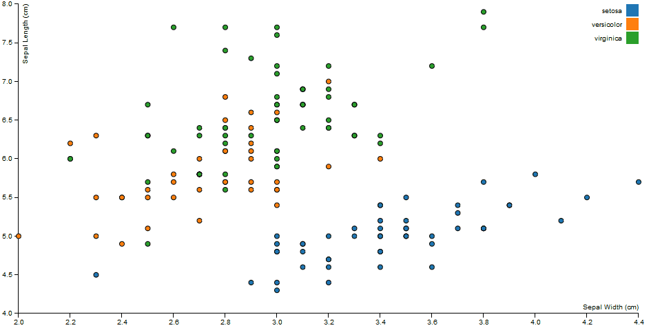

# Transition

Add transition on existing graph.
This graph was created by Mike Bostock. The code can be found here: https://bl.ocks.org/mbostock/3887118

## Feature
<ul>
<li><a href="https://github.com/mbostock/d3/wiki/CSV">d3.tsv</a> - load and parse data</li>
<li><a href="https://github.com/mbostock/d3/wiki/Quantitative-Scales">d3.scale.linear</a> - <em>x</em>- and <em>y</em>-position encoding</li>
<li><a href="https://github.com/mbostock/d3/wiki/Ordinal-Scales">d3.scale.ordinal</a> - color encoding</li>
<li><a href="https://github.com/mbostock/d3/wiki/Arrays#wiki-d3_extent">d3.extent</a> - compute domains</li>
<li><a href="https://github.com/mbostock/d3/wiki/SVG-Axes">d3.svg.axis</a> - display axes</li>
</ul>
## Licence
MIT License

Copyright (c) [2017] [Chanakarn Niyornram]
