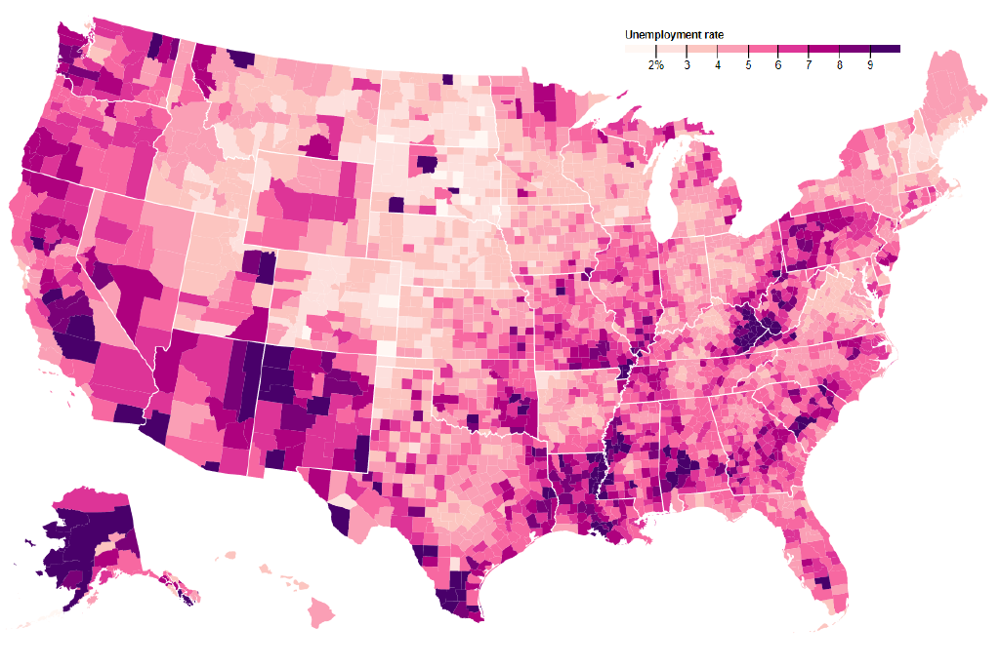

# Transition in d3

d3’s transitions.  The chart used is based on a [`bl.ock`](https://bl.ocks.org/mbostock/4060606) by [**@mbostock**](https://github.com/mbostock) (GPL-3.0).



## Background

In this chart I made a few additions to have transitions in the chart.
The transitions I added where:

For a smooth fade-in
```javascript
g.style("opacity", "0")
    .transition()
    .duration(1000)
    .style("opacity", "1")
    .attr("transform", "translate(0,40)");
```

For a transition in the scale. The delay is calculated by the location in the array times 300
```javascript
g.selectAll("rect")
  .data(color.range().map(function(d) {
      d = color.invertExtent(d);
      if (d[0] == null) d[0] = x.domain()[0];
      if (d[1] == null) d[1] = x.domain()[1];
      return d;
    }))
  .enter().append("rect")
    .attr("height", 8)
    .attr("x", function(d) { return x(d[0]); })
    .transition()
    .delay(function(d,i) { return i * 300 })
    .duration(500)
    .attr("width", function(d) { return x(d[1]) - x(d[0]); })
    .style("fill", function(d) { return color(d[0]); });
```

Each county appears after eachother. The delay is the location in the array
```javascript
svg.append("g")
      .attr("class", "counties")
    .selectAll("path")
    .data(topojson.feature(us, us.objects.counties).features)
    .enter().append("path")
      .style("fill", "#fff")
      .attr("d", path)
      .transition()
      .delay(function(d,i) { return i })
      .duration(1000)
      .style("fill", function(d) { return color(d.rate = unemployment.get(d.id)); })
```

After 3500ms the stroke for showing the different states fades in.
```javascript
svg.append("path")
      .datum(topojson.mesh(us, us.objects.states, function(a, b) { return a !== b; }))
      .attr("class", "states")
      .attr("d", path)
      .transition()
      .delay(3500)
      .duration(1000)
      .style("stroke-width", "1")

}
```

> Next to the transitions I added my own style/color in the chart. I also made the code my own by for example changing the `''` to `""`

## Data

The unemployment rate of Americans

`id` — Where in America
`rate` — The actual unemployment rate
 
## Features

*   [`d3-geo`](https://github.com/d3/d3-geo/blob/master/README.md#geoPath)
    — `d3.path`
    — Map of America
*   [`d3-array`](https://github.com/d3/d3-array#api-reference)
    — `d3.domain` and `d3.range`
    — Array statistics and transformations
*   [`d3-request`](https://github.com/d3/d3-request)
    — `d3.tsv`
*   [`d3-selection`](https://github.com/d3/d3-selection#api-reference)
    — `d3.select` and `d3.selectAll`
    — Select elements
*   [`d3-transition`](https://github.com/d3/d3-transition#api-reference)
    — `d3.delay`, `d3.duration`, and `d3.transition`
    — Animated transitions

## License

GPL-3.0 © Victor Zumpolle


