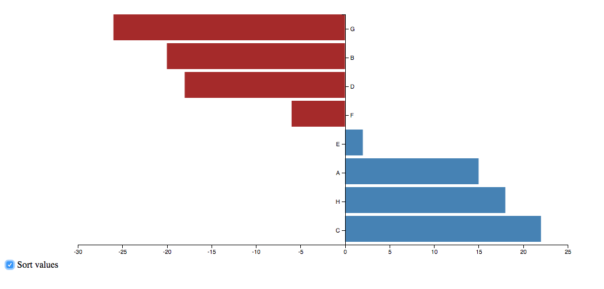

# Interaction d3
###### change interaction in a static chart

## Background.
i've modified a [bar chart with negative values](https://bl.ocks.org/ch-bu/f3d1fc6e905f80b0706663fbefe317bc). The bar chart  has sorted from a-z name values.
I've used the sort example from [@wooorm](https://cmda-tt.github.io/course-17-18/class-4/sort/) to be able to sort the barchart between names and values

## process

It was difficult to change the sort function for x-axis to y-axis. I've changed all the values x to y, but the labels and line of the negative values didn't stay in place.
I fixed this by adding a class "nega" to the negative values, and change the position of the text.x and line.x from negative to positive.

```JS

    d3.selectAll('.nega') //change the values of x2 of the line at the negative values. this way the line will stay of the correct side of the y axis
    .selectAll('line')
    .transition()
    .attr('x2', 6);

    d3.selectAll('.nega') //change the values of x of the text(label) at the negative values. this way the text(label) will stay of the correct side of the y axis
    .selectAll('text')
    .transition()
    .attr('x','9')
    
```

## license

GNU @Basrikkers



