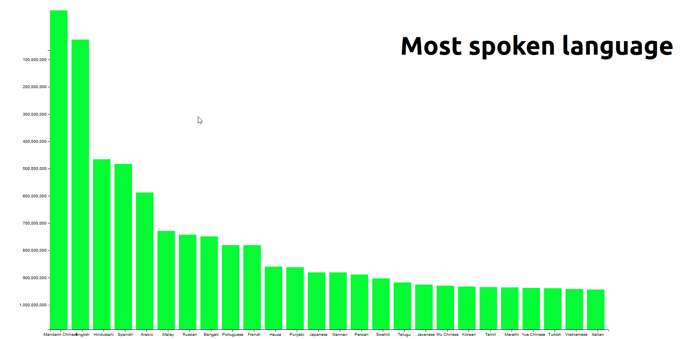

# Transition

The graph is taken from the first assignment. This graph have the added functionality that it has a tooltip that the user can hover over it.

## The Features
the list show the features that are used to creat this chart.
* [d3.max](https://github.com/d3/d3-array/blob/master/README.md#max)
* [d3.axisBottom()](https://github.com/d3/d3-array/blob/master/README.md#max)
* [d3.axisLeft()](https://github.com/d3/d3-axis/blob/master/README.md#axisLeft)
* [d3.tsv](https://github.com/d3/d3-request/blob/master/README.md#tsv)
* [d3.select](https://github.com/d3/d3-selection/blob/master/README.md#select)
* [d3.scaleBand()](https://github.com/d3/d3-scale/blob/master/README.md#scaleBand)
* [d3.scaleLinear()](https://github.com/d3/d3-scale/blob/master/README.md#scaleLinear)

## Workflow

Te first thing I want to know are the basic function of D3 and that's why I choose to watch the video: ['Introduction to D3' by Curran Kelleher](https://www.youtube.com/watch?v=8jvoTV54nXw).

The second thing was choosing a data and making sensen out of it. For me it was the language data. 

After that, I went searching  for a code example to get inspiration from and the [Bar chart by Mike Bostock](https://bl.ocks.org/mbostock/3885304) is a really great one

The last thing is just getting started ")
Most of the code is self writin.

### License
Released under the GNU General Public License, version 3.
