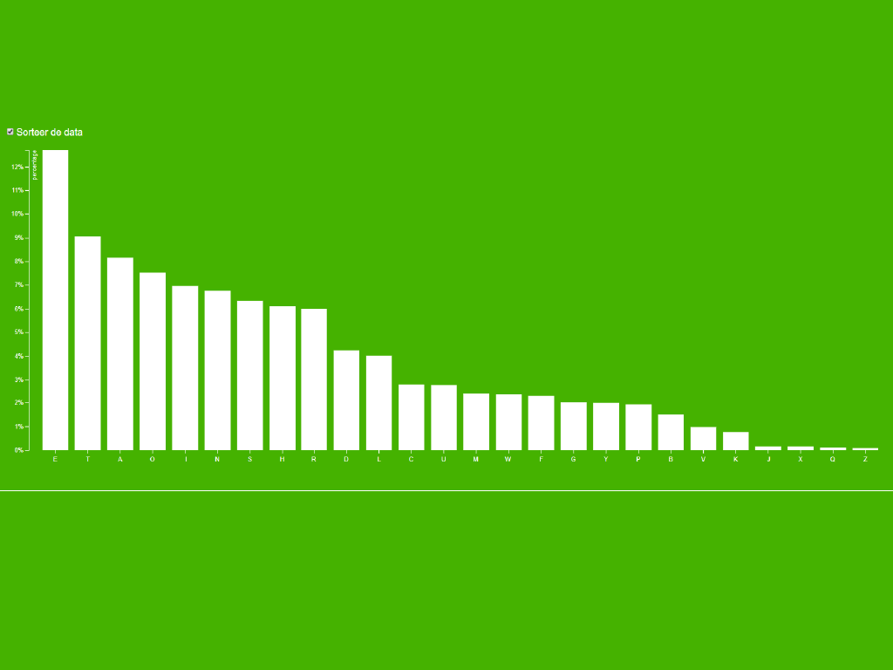

# Interaction in a graph

This is a little barchart of letter usage. It is based [`bl.ock`](https://bl.ocks.org/mbostock/3885304) by
[**@mbostock**](https://github.com/mbostock) (GPL-3.0).

## Background

I got the chart I made previously and changed it up a bit. I used an dataset that was used in one of the examples.

After I got the chart working I tried to have a good interaction with a little transition. Titus Wormer showed us an example in the lesson. And with that in mind I tried to do my best to get it working. 

> In the end it worked well. I added a few comments and made the code look readable. 

## Data

d3 is using a CSV (comma-separated value) file to make a visualization.
* `letter` — All leter in the alphabet
* `frequency` — The frequency that they are used

## Features
*   [`d3-array`](https://github.com/d3/d3-array#api-reference)
    — `d3.max`
    — Array statistics
*   [`d3-axis`](https://github.com/d3/d3-axis#api-reference)
    — `d3.axisBottom` and `d3.axisLeft`
    — Reference marks for scales
*   [`d3-request`](https://github.com/d3/d3-request#api-reference)
    — `d3.csv`
    — Loading files
*   [`d3-scale`](https://github.com/d3/d3-scale#api-reference)
    — `d3.scaleBand` and `d3.scaleLinear`
    — Position encodings

## License

GPL-3.0 © Victor Zumpolle
